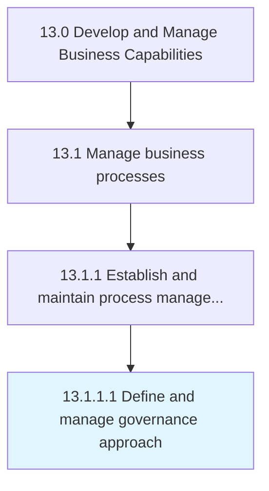

# Define and manage governance approach

> Outlining and managing the methodology for administering business process management (BPM).

## Overview

Activity 13.1.1.1 is an activity within the Develop and Manage Business Capabilities framework. 

Outlining and managing the methodology for administering business process management (BPM). Define the method for setting standards and priorities for BPM efforts. Identify BPM governance leaders. Define BPM project participants' roles.

## Process Hierarchy



## Key Statistics

| Metric | Value |
|--------|-------|
| APQC Code | 16380 |
| Hierarchy ID | 13.1.1.1 |
| Level | Activity |
| Parent | [13.1.1](../) |
| Sub-Processes | 0 |


## GraphDL Semantic Structure

```
define.AndManageGovernanceApproach
```

| Component | Value | Description |
|-----------|-------|-------------|
| Verb | `define` | Primary action |
| Object | `and manage governance approach` | Direct object |


## Related Concepts

- GovernanceApproach
- GovernanceApproach


---

*Source: APQC PCF 16380 (13.1.1.1) - APQC*
