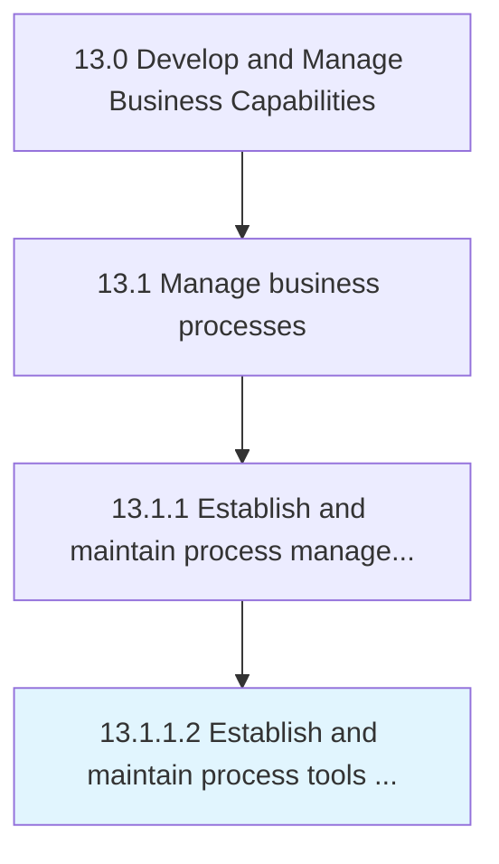

# Establish and maintain process tools and templates

> Instituting, organizing, and maintaining the upkeep of the techniques used for business process management (BPM).

## Overview

Activity 13.1.1.2 is an activity within the Develop and Manage Business Capabilities framework. 

Instituting, organizing, and maintaining the upkeep of the techniques used for business process management (BPM). Create and maintain templates of BPM tools that can be readily implemented, including process engine, business analytics, content management, and collaboration tools.

## Process Hierarchy



## Key Statistics

| Metric | Value |
|--------|-------|
| APQC Code | 16381 |
| Hierarchy ID | 13.1.1.2 |
| Level | Activity |
| Parent | [13.1.1](../) |
| Sub-Processes | 0 |


## GraphDL Semantic Structure

```
establish.AndMaintainProcessToolsAndTemplates
```

| Component | Value | Description |
|-----------|-------|-------------|
| Verb | `establish` | Primary action |
| Object | `and maintain process tools and templates` | Direct object |


## Related Concepts

- ProcessTools
- Templates
- ProcessTools
- Templates


---

*Source: APQC PCF 16381 (13.1.1.2) - APQC*
