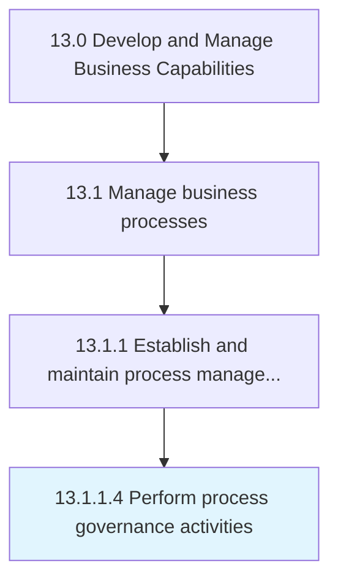

# Perform process governance activities

> Implementing and executing activities for governing business processes.

## Overview

Activity 13.1.1.4 is an activity within the Develop and Manage Business Capabilities framework. 

Implementing and executing activities for governing business processes. Execute activities that encourage participation, accountability, transparency, responsiveness, equity and inclusiveness, etc. within the business processes.

## Process Hierarchy



## Key Statistics

| Metric | Value |
|--------|-------|
| APQC Code | 16383 |
| Hierarchy ID | 13.1.1.4 |
| Level | Activity |
| Parent | [13.1.1](../) |
| Sub-Processes | 0 |


## GraphDL Semantic Structure

```
perform.ProcessGovernanceActivities
```

| Component | Value | Description |
|-----------|-------|-------------|
| Verb | `perform` | Primary action |
| Object | `process governance activities` | Direct object |


## Related Concepts

- ProcessGovernanceActivities


---

*Source: APQC PCF 16383 (13.1.1.4) - APQC*
