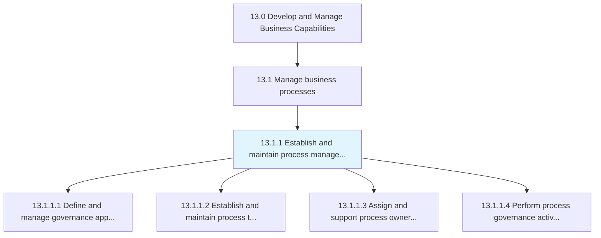
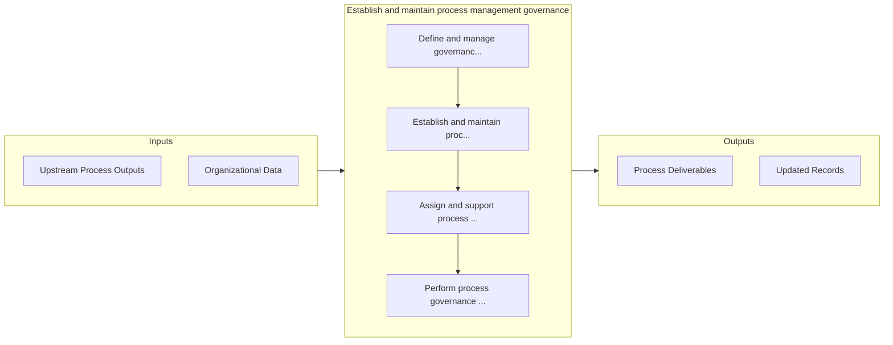

# Establish and maintain process management governance

> Defining and managing the organization's approach to governing business process management.

## Overview

Process 13.1.1 is a core process that defines the specific procedures for establish and maintain process management governance. 

Defining and managing the organization's approach to governing business process management. Establish and manage tools to support the governance process. Assign ownership for all business processes. Perform activities to administer the governing process.

## Process Hierarchy



## Key Statistics

| Metric | Value |
|--------|-------|
| APQC Code | 16379 |
| Hierarchy ID | 13.1.1 |
| Level | Process |
| Parent | [13.1](../) |
| Sub-Processes | 4 |


## GraphDL Semantic Structure

```
establish.AndMaintainProcessManagementGovernance
```

| Component | Value | Description |
|-----------|-------|-------------|
| Verb | `establish` | Primary action |
| Object | `and maintain process management governance` | Direct object |


## Process Flow



## Sub-Processes

| Process | Hierarchy ID | Description |
|---------|-------------|-------------|
| [Define and manage governance approach](./DefineAndManageGovernanceApproach) | 13.1.1.1 | Outlining and managing the methodology for administering business process management (BPM) |
| [Establish and maintain process tools and templates](./EstablishAndMaintainProcessToolsAndTemplates) | 13.1.1.2 | Instituting, organizing, and maintaining the upkeep of the techniques used for business process mana |
| [Assign and support process ownership](./AssignAndSupportProcessOwnership) | 13.1.1.3 | Assigning resources (employees) ownership of tasks |
| [Perform process governance activities](./PerformProcessGovernanceActivities) | 13.1.1.4 | Implementing and executing activities for governing business processes |


## Related Concepts

- [ProcessManagementGovernance](/concepts/ProcessManagementGovernance)
- [ProcessManagementGovernance](/concepts/ProcessManagementGovernance)


---

*Source: APQC PCF 16379 (13.1.1) - APQC*
