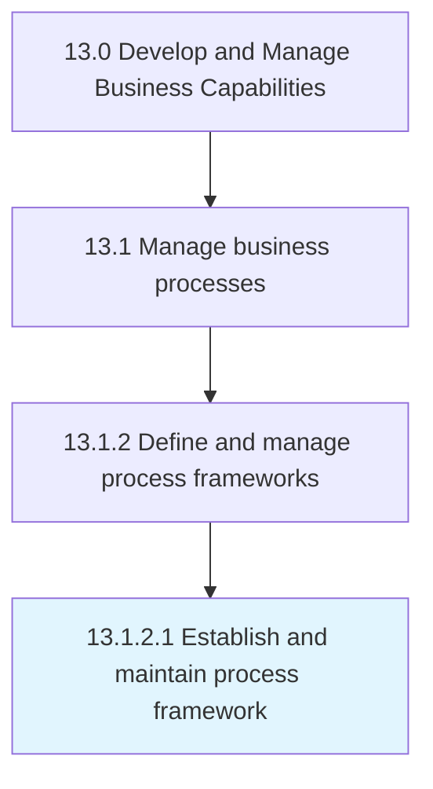

# Establish and maintain process framework

> Defining and managing the framework that outlines the required business processes of the organization, key elements, and how they should interact.

## Overview

Activity 13.1.2.1 is an activity within the Develop and Manage Business Capabilities framework. 

Defining and managing the framework that outlines the required business processes of the organization, key elements, and how they should interact. Institute strategy infrastructure and product, operations, and enterprise management.

## Process Hierarchy



## Key Statistics

| Metric | Value |
|--------|-------|
| APQC Code | 16385 |
| Hierarchy ID | 13.1.2.1 |
| Level | Activity |
| Parent | [13.1.2](../) |
| Sub-Processes | 0 |


## GraphDL Semantic Structure

```
establish.AndMaintainProcessFramework
```

| Component | Value | Description |
|-----------|-------|-------------|
| Verb | `establish` | Primary action |
| Object | `and maintain process framework` | Direct object |


## Related Concepts

- ProcessFramework
- ProcessFramework


---

*Source: APQC PCF 16385 (13.1.2.1) - APQC*
