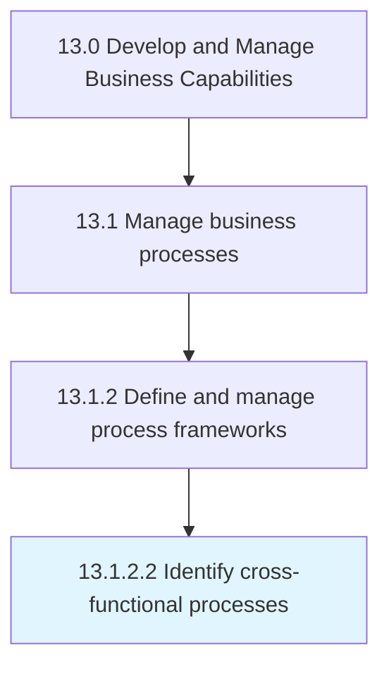

# Identify cross-functional processes

> Recognizing the different functional areas working on the same project or goal.

## Overview

Activity 13.1.2.2 is an activity within the Develop and Manage Business Capabilities framework. 

Recognizing the different functional areas working on the same project or goal.

## Process Hierarchy



## Key Statistics

| Metric | Value |
|--------|-------|
| APQC Code | 16386 |
| Hierarchy ID | 13.1.2.2 |
| Level | Activity |
| Parent | [13.1.2](../) |
| Sub-Processes | 0 |


## GraphDL Semantic Structure

```
identify.CrossfunctionalProcesses
```

| Component | Value | Description |
|-----------|-------|-------------|
| Verb | `identify` | Primary action |
| Object | `cross-functional processes` | Direct object |


---

*Source: APQC PCF 16386 (13.1.2.2) - APQC*
