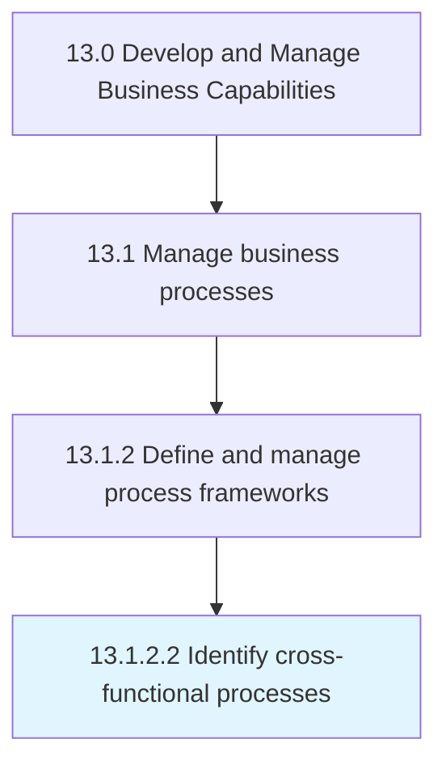

# Identify cross-functional processes

> Recognizing the different functional areas working on the same project or goal.

## Overview

The identify cross-functional processes process is a critical component of the Business Capabilities function within an organization. It encompasses the systematic approach to identify cross-functional processes, ensuring that all activities are performed consistently, efficiently, and in alignment with organizational objectives. This process establishes the framework through which identify cross-functional processes is executed, monitored, and continuously improved to deliver value across the enterprise.

Within the APQC Process Classification Framework (hierarchy 13.1.2.2), this activity supports the broader "Develop and Manage Business Capabilities" category. Effective execution requires cross-functional collaboration, clear accountability, and robust governance mechanisms. Organizations that mature this process typically see improved operational performance, reduced risk exposure, and stronger alignment between tactical activities and strategic goals.


## Process Hierarchy


```mermaid
graph TD
    C13["13.0 Develop and Manage Business Capabilities"]
    C13 --> N13_1["13.1 Manage business processes"]
    N13_1 --> N13_1_2["13.1.2 Define and manage process frameworks"]
    N13_1_2 --> N13_1_2_2["13.1.2.2 Identify cross-functional processes"]
    style N13_1_2_2 fill:#e1f5fe
```

## Key Statistics

| Metric | Value |
|--------|-------|
| APQC Code | 16386 |
| Hierarchy ID | 13.1.2.2 |
| Level | Activity |
| Parent | [13.1.2](../) |
| Sub-Processes | 0 |


## GraphDL Semantic Structure

```graphdl
identify.CrossfunctionalProcesses
```

| Component | Value | Description |
|-----------|-------|-------------|
| Verb | `identify` | Primary action |
| Object | `cross-functional processes` | Direct object |


---

*Source: APQC PCF 16386 (13.1.2.2) - APQC*
