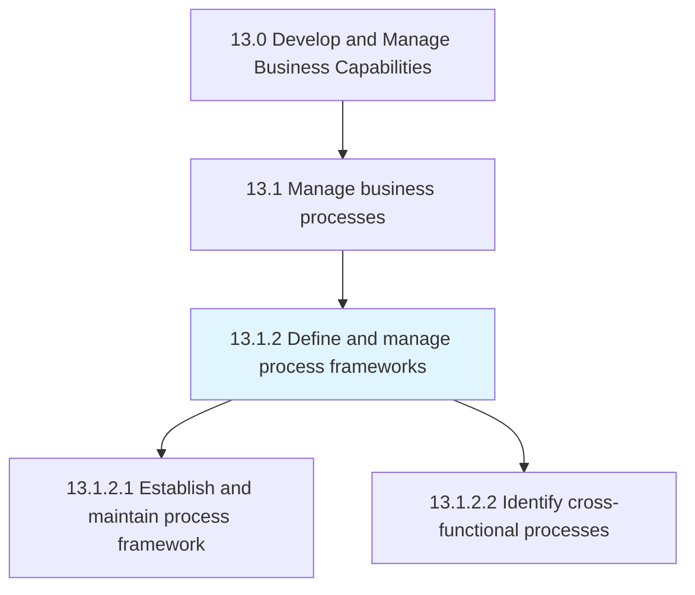
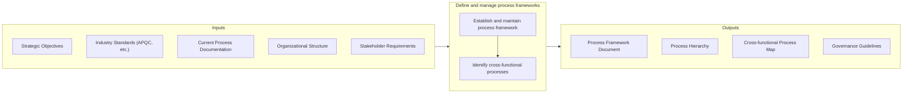

# Define and manage process frameworks

> Determining and organizing the structural composition of business processes.

## Overview

Process 13.1.2 is a core process that defines the specific procedures for defining and managing process frameworks. This process establishes the foundational architecture that governs how business processes are structured, documented, and managed across the organization.

A process framework provides a common language and structure for describing business operations. It enables consistent process documentation, facilitates cross-functional understanding, and supports process improvement initiatives. Effective frameworks align with industry standards (such as APQC PCF) while accommodating organization-specific requirements.

This process encompasses designing the framework structure, establishing governance mechanisms, and identifying cross-functional processes that span multiple departments or business units. The framework serves as the foundation for process definition, measurement, and improvement activities.

## Process Hierarchy



## Key Statistics

| Metric | Value |
|--------|-------|
| APQC Code | 16384 |
| Hierarchy ID | 13.1.2 |
| Level | Process |
| Parent | [13.1](../) |
| Sub-Processes | 2 |


## GraphDL Semantic Structure

```graphdl
define.ProcessFrameworks.and.ManageProcessFrameworks
```

| Component | Value | Description |
|-----------|-------|-------------|
| Verb | `define` | Primary action of establishing structure |
| Object | `process frameworks` | Structural foundation for process management |
| Preposition | `and` | Conjunction linking dual actions |
| PrepObject | `manage process frameworks` | Ongoing governance and maintenance |


## Process Flow



## Child Processes

### 13.1.2.1 Establish and Maintain Process Framework

Defining and managing the framework that outlines the required business processes of the organization. This activity creates the structural foundation for all process documentation and governance.

**Key Activities:**
- Define process hierarchy levels and naming conventions
- Establish process documentation standards
- Create process taxonomy aligned with industry standards
- Develop governance model for framework maintenance
- Integrate framework with enterprise architecture

[View Process Details](./EstablishAndMaintainProcessFramework)

### 13.1.2.2 Identify Cross-Functional Processes

Recognizing the different functional areas working on the same project or goal. This activity maps processes that span organizational boundaries and require coordination across departments.

**Key Activities:**
- Map end-to-end process flows across functions
- Identify process handoffs and integration points
- Document process ownership and RACI assignments
- Analyze dependencies and coordination requirements
- Establish cross-functional governance mechanisms

[View Process Details](./IdentifyCrossfunctionalProcesses)


## RACI Matrix

| Activity | Responsible | Accountable | Consulted | Informed |
|----------|-------------|-------------|-----------|----------|
| Define framework structure | Process Architect | Process Director | Department Heads | All process owners |
| Establish governance model | Process Manager | Process Director | Legal, Compliance | Executive team |
| Document framework standards | Process Analyst | Process Manager | IT, Quality | All employees |
| Map cross-functional processes | Process Analyst | Process Manager | Department Leads | Process owners |
| Maintain framework updates | Process Team | Process Manager | Stakeholders | All users |
| Review and approve changes | Process Manager | Process Director | Change Board | Framework users |


## Metrics and KPIs

| Metric | Description | Target |
|--------|-------------|--------|
| Framework Coverage | Percentage of processes documented in framework | 100% |
| Framework Adoption | Percentage of units using standard framework | >95% |
| Cross-functional Process Map Completeness | Percentage of end-to-end processes mapped | >90% |
| Framework Update Cycle | Time between framework reviews/updates | Quarterly |
| Documentation Consistency | Adherence to framework standards | >98% |
| Stakeholder Satisfaction | Satisfaction with framework usability | >4.0/5.0 |


## Related Departments

- [Executive Office](/departments/Executive) - Strategic alignment and governance approval
- [Operations](/departments/Operations) - Operational process definition
- [Information Technology](/departments/IT) - System and data process integration
- [Quality](/departments/Quality) - Process quality standards
- [Human Resources](/departments/HR) - People and role-related processes


## Related Occupations

- [Management Analysts](/occupations/Business/ManagementAnalysts) - Process framework design
- [Business Process Analysts](/occupations/Business/ProcessAnalysts) - Process documentation
- [Enterprise Architects](/occupations/Technology/EnterpriseArchitects) - Integration with enterprise architecture
- [Operations Research Analysts](/occupations/Business/OperationsResearch) - Process optimization


## Industry Variations

### Manufacturing

Manufacturing process frameworks emphasize production workflows, quality control points, and supply chain integration. Frameworks often align with lean manufacturing and ISO 9001 requirements.

### Financial Services

Financial services frameworks focus on compliance, risk controls, and audit requirements. Regulatory processes require detailed documentation and traceability.

### Healthcare

Healthcare process frameworks must accommodate clinical workflows, patient safety requirements, and regulatory compliance (HIPAA, Joint Commission).


---

*Source: APQC PCF 16384 (13.1.2) - APQC*
