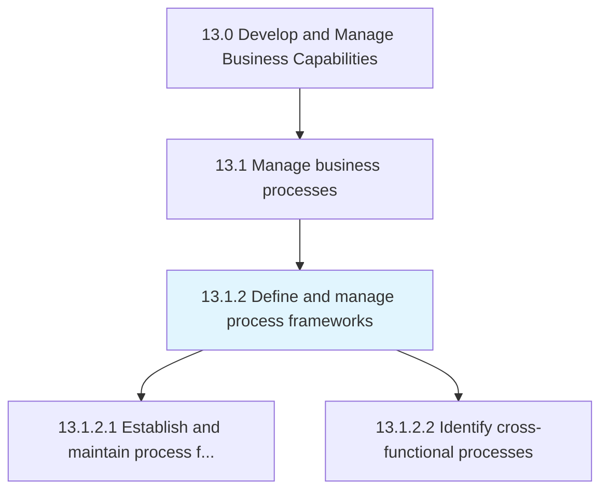
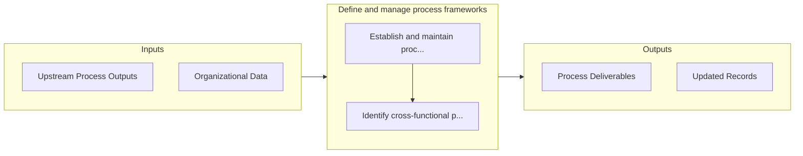

# Define and manage process frameworks

> Determining and organizing the structural composition of business processes.

## Overview

Process 13.1.2 is a core process that defines the specific procedures for define and manage process frameworks. 

Determining and organizing the structural composition of business processes. Design, establish, and administer the framework. Identify any cross-functional processes that are mandatory for achieving business excellence.

## Process Hierarchy



## Key Statistics

| Metric | Value |
|--------|-------|
| APQC Code | 16384 |
| Hierarchy ID | 13.1.2 |
| Level | Process |
| Parent | [13.1](../) |
| Sub-Processes | 2 |


## GraphDL Semantic Structure

```graphdl
define.AndManageProcessFrameworks
```

| Component | Value | Description |
|-----------|-------|-------------|
| Verb | `define` | Primary action |
| Object | `and manage process frameworks` | Direct object |


## Process Flow



## Sub-Processes

| Process | Hierarchy ID | Description |
|---------|-------------|-------------|
| [Establish and maintain process framework](./EstablishAndMaintainProcessFramework) | 13.1.2.1 | Defining and managing the framework that outlines the required business processes of the organizatio |
| [Identify cross-functional processes](./IdentifyCrossfunctionalProcesses) | 13.1.2.2 | Recognizing the different functional areas working on the same project or goal |


## Related Concepts

- ProcessFrameworks
- ProcessFrameworks


---

*Source: APQC PCF 16384 (13.1.2) - APQC*
