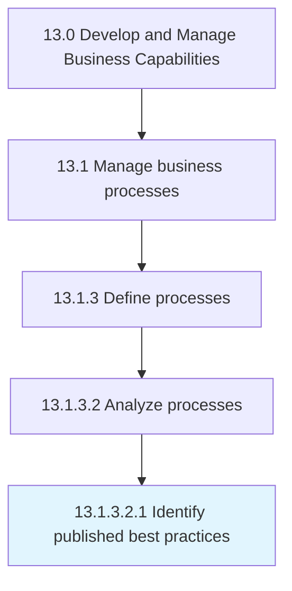

# Identify published best practices

> Realizing those practices and procedures that are the most effective to the success of the business and making that information available.

## Overview

Sub-Activity 13.1.3.2.1 is an activity within the Develop and Manage Business Capabilities framework. 

Realizing those practices and procedures that are the most effective to the success of the business and making that information available.

## Process Hierarchy



## Key Statistics

| Metric | Value |
|--------|-------|
| APQC Code | 20140 |
| Hierarchy ID | 13.1.3.2.1 |
| Level | Sub-Activity |
| Parent | [13.1.3.2](../) |
| Sub-Processes | 0 |


## GraphDL Semantic Structure

```
identify.PublishedBestPractices
```

| Component | Value | Description |
|-----------|-------|-------------|
| Verb | `identify` | Primary action |
| Object | `published best practices` | Direct object |


## Related Concepts

- [PublishedBestPractices](/concepts/PublishedBestPractices)


---

*Source: APQC PCF 20140 (13.1.3.2.1) - APQC*
