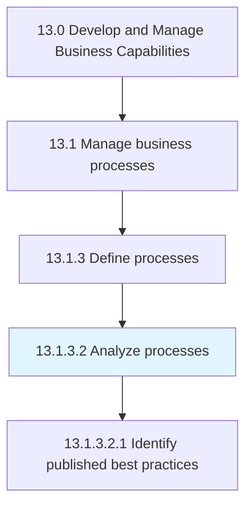
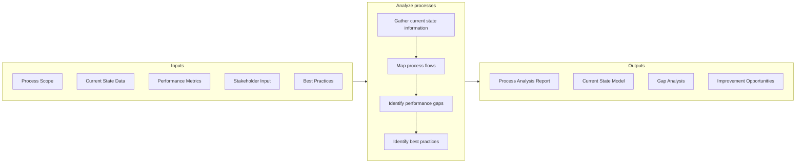

# Analyze processes

> Assessing and examining the set of activities and tasks that, once completed, will accomplish an organizational goal.

## Overview

Activity 13.1.3.2 is an activity within the Develop and Manage Business Capabilities framework. This activity involves systematically examining business processes to understand how they work, identify performance gaps, and uncover improvement opportunities.

Process analysis creates a business process model that captures how work flows through the organization and how individuals from different groups collaborate to achieve business objectives. It employs various analytical techniques to understand current state performance, compare against benchmarks and best practices, and identify root causes of problems.

Effective process analysis is a prerequisite for meaningful process improvement. It provides the factual foundation for understanding where processes are working well and where they need enhancement. The outputs of this activity inform process definition (13.1.3.4) and process improvement (13.1.5) initiatives.

## Process Hierarchy



## Key Statistics

| Metric | Value |
|--------|-------|
| APQC Code | 16389 |
| Hierarchy ID | 13.1.3.2 |
| Level | Activity |
| Parent | [13.1.3](../) |
| Sub-Processes | 1 |


## GraphDL Semantic Structure

```graphdl
analyze.Processes
```

| Component | Value | Description |
|-----------|-------|-------------|
| Verb | `analyze` | Primary action |
| Object | `processes` | Direct object |


## Process Flow



## Child Processes

### 13.1.3.2.1 Identify Published Best Practices

Realizing those practices and procedures that are the most effective to the success of the business through research and benchmarking. This sub-activity identifies industry and cross-industry best practices that can inform process improvement.

**Key Activities:**
- Research industry best practices
- Review benchmarking data and studies
- Identify leading practices from peers
- Evaluate applicability to organization
- Document best practice recommendations

[View Process Details](./IdentifyPublishedBestPractices)


## RACI Matrix

| Activity | Responsible | Accountable | Consulted | Informed |
|----------|-------------|-------------|-----------|----------|
| Gather current state | Process Analyst | Process Manager | Process Owners | Stakeholders |
| Map process flows | Process Analyst | Process Manager | SMEs | Operations |
| Analyze performance data | Business Analyst | Process Manager | Finance, Quality | Management |
| Identify performance gaps | Process Analyst | Process Manager | Stakeholders | Executive team |
| Research best practices | Process Analyst | Process Manager | Industry groups | Stakeholders |
| Document findings | Process Analyst | Process Manager | Quality | Process Owners |


## Metrics and KPIs

| Metric | Description | Target |
|--------|-------------|--------|
| Analysis Completion Rate | Processes analyzed per plan | 100% |
| Analysis Depth | Completeness of analysis | All dimensions |
| Gap Identification | Improvement opportunities identified | Per process |
| Stakeholder Engagement | Input gathered from process participants | >90% coverage |
| Best Practice Coverage | Relevant best practices identified | Comprehensive |
| Analysis Cycle Time | Time to complete process analysis | <30 days |


## Related Departments

- [Operations](/departments/Operations) - Process execution and performance data
- [Quality](/departments/Quality) - Quality performance insights
- [Finance](/departments/Finance) - Cost and efficiency analysis
- [Information Technology](/departments/IT) - System performance data


## Related Occupations

- [Business Process Analysts](/occupations/Business/ProcessAnalysts) - Process analysis
- [Management Analysts](/occupations/Business/ManagementAnalysts) - Performance analysis
- [Operations Research Analysts](/occupations/Business/OperationsResearch) - Quantitative analysis
- [Industrial Engineers](/occupations/Engineering/IndustrialEngineers) - Process engineering


## Analysis Techniques

Process analysis employs various methods:

- **Process Mapping** - Visual representation of process flows
- **Value Stream Mapping** - Value-add vs. non-value-add analysis
- **Root Cause Analysis** - Problem investigation methods
- **Benchmarking** - Comparative performance analysis
- **Time and Motion Study** - Activity timing and efficiency
- **Bottleneck Analysis** - Constraint identification


## Analysis Dimensions

Comprehensive process analysis examines:

- **Flow** - Sequence of activities and handoffs
- **Time** - Cycle time, wait time, processing time
- **Cost** - Activity-based costs and efficiency
- **Quality** - Error rates and defect patterns
- **Compliance** - Adherence to policies and regulations
- **Customer** - Impact on customer experience


---

*Source: APQC PCF 16389 (13.1.3.2) - APQC*
