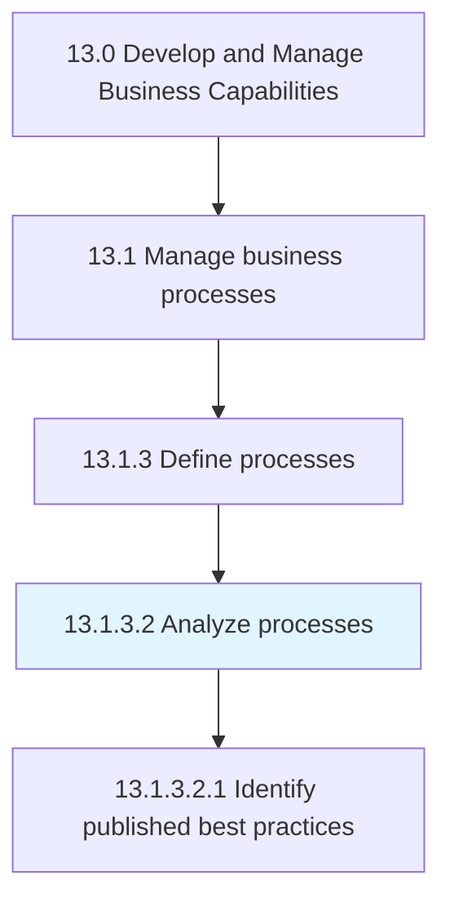
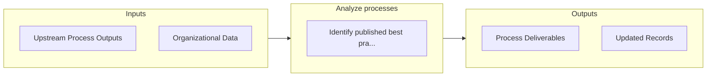

# Analyze processes

> Assessing and examining the set of activities and tasks that, once completed, will accomplish an organizational goal.

## Overview

Activity 13.1.3.2 is an activity within the Develop and Manage Business Capabilities framework. 

Assessing and examining the set of activities and tasks that, once completed, will accomplish an organizational goal. Create a business process model that captures how a business process works and how individuals from different groups work together to achieve a business goal.

## Process Hierarchy



## Key Statistics

| Metric | Value |
|--------|-------|
| APQC Code | 16389 |
| Hierarchy ID | 13.1.3.2 |
| Level | Activity |
| Parent | [13.1.3](../) |
| Sub-Processes | 1 |


## GraphDL Semantic Structure

```graphdl
analyze.Processes
```

| Component | Value | Description |
|-----------|-------|-------------|
| Verb | `analyze` | Primary action |
| Object | `processes` | Direct object |


## Process Flow



## Sub-Processes

| Process | Hierarchy ID | Description |
|---------|-------------|-------------|
| [Identify published best practices](./IdentifyPublishedBestPractices) | 13.1.3.2.1 | Realizing those practices and procedures that are the most effective to the success of the business  |


## Related Concepts

- Processes


---

*Source: APQC PCF 16389 (13.1.3.2) - APQC*
