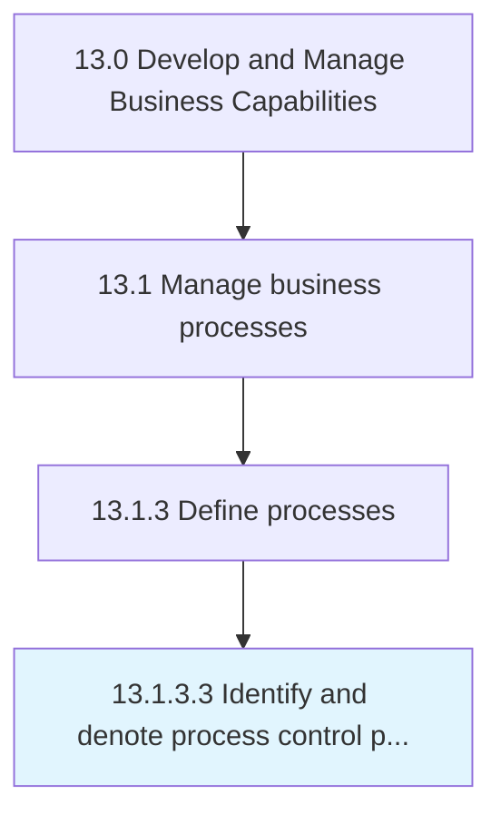

# Identify and denote process control points

> Establishment of a "checkpoint" in a process that prevent the process from continuing unless all requirements are satisfied.

## Overview

Activity 13.1.3.3 is an activity within the Develop and Manage Business Capabilities framework. 

Establishment of a "checkpoint" in a process that prevent the process from continuing unless all requirements are satisfied.

## Process Hierarchy



## Key Statistics

| Metric | Value |
|--------|-------|
| APQC Code | 21452 |
| Hierarchy ID | 13.1.3.3 |
| Level | Activity |
| Parent | [13.1.3](../) |
| Sub-Processes | 0 |


## GraphDL Semantic Structure

```
identify.AndDenoteProcessControlPoints
```

| Component | Value | Description |
|-----------|-------|-------------|
| Verb | `identify` | Primary action |
| Object | `and denote process control points` | Direct object |


## Related Concepts

- [DenoteProcessControlPoints](/concepts/DenoteProcessControlPoints)


---

*Source: APQC PCF 21452 (13.1.3.3) - APQC*
