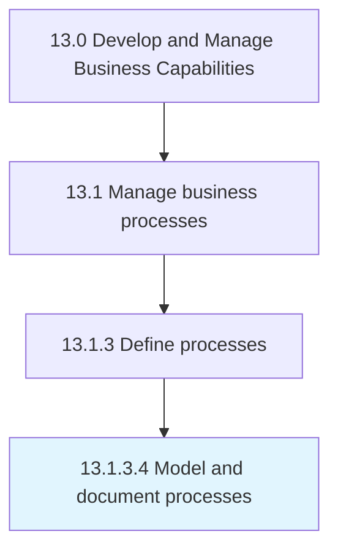

# Model and document processes

> Defining what a business entity does, who is responsible, to what standard a business process should be completed, and how the success of a business process can be determined.

## Overview

Activity 13.1.3.4 is an activity within the Develop and Manage Business Capabilities framework. 

Defining what a business entity does, who is responsible, to what standard a business process should be completed, and how the success of a business process can be determined. Identify processes, gather information gathering, interview participants, map processes, and perform analysis.

## Process Hierarchy



## Key Statistics

| Metric | Value |
|--------|-------|
| APQC Code | 16390 |
| Hierarchy ID | 13.1.3.4 |
| Level | Activity |
| Parent | [13.1.3](../) |
| Sub-Processes | 0 |


## GraphDL Semantic Structure

```
model.AndDocumentProcesses
```

| Component | Value | Description |
|-----------|-------|-------------|
| Verb | `model` | Primary action |
| Object | `and document processes` | Direct object |


## Related Concepts

- [Processes](/concepts/Processes)
- [Processes](/concepts/Processes)


---

*Source: APQC PCF 16390 (13.1.3.4) - APQC*
