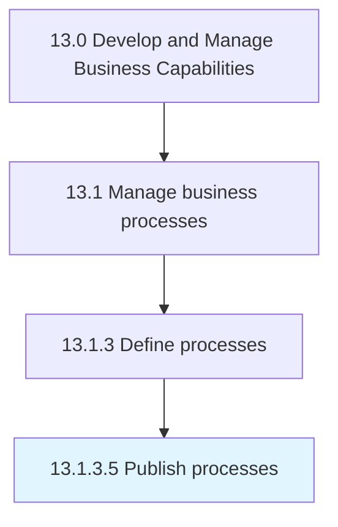

# Publish processes

> Disclosing the information available on business processes.

## Overview

Activity 13.1.3.5 is an activity within the Develop and Manage Business Capabilities framework. 

Disclosing the information available on business processes. Ensure the availability of the information regarding the business processes to all process team members, business stakeholders, and process owners. Use BPM software, as well as business process diagrams and documents that help depict the required information.

## Process Hierarchy



## Key Statistics

| Metric | Value |
|--------|-------|
| APQC Code | 16391 |
| Hierarchy ID | 13.1.3.5 |
| Level | Activity |
| Parent | [13.1.3](../) |
| Sub-Processes | 0 |


## GraphDL Semantic Structure

```
publish.Processes
```

| Component | Value | Description |
|-----------|-------|-------------|
| Verb | `publish` | Primary action |
| Object | `processes` | Direct object |


## Related Concepts

- Processes


---

*Source: APQC PCF 16391 (13.1.3.5) - APQC*
