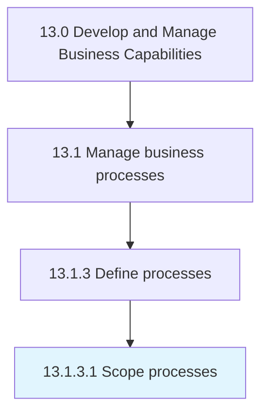

# Scope processes

> Defining the extent and limits of business processes.

## Overview

Activity 13.1.3.1 is an activity within the Develop and Manage Business Capabilities framework. 

Defining the extent and limits of business processes. Define the range and diversity of all the set of activities and tasks that, once completed, will accomplish an organizational goal.

## Process Hierarchy



## Key Statistics

| Metric | Value |
|--------|-------|
| APQC Code | 16388 |
| Hierarchy ID | 13.1.3.1 |
| Level | Activity |
| Parent | [13.1.3](../) |
| Sub-Processes | 0 |


## GraphDL Semantic Structure

```
scope.Processes
```

| Component | Value | Description |
|-----------|-------|-------------|
| Verb | `scope` | Primary action |
| Object | `processes` | Direct object |


## Related Concepts

- [Processes](/concepts/Processes)


---

*Source: APQC PCF 16388 (13.1.3.1) - APQC*
