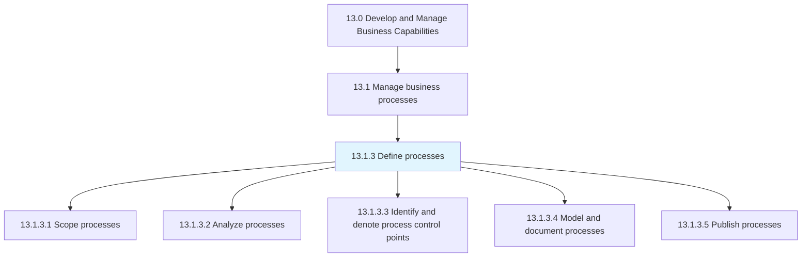
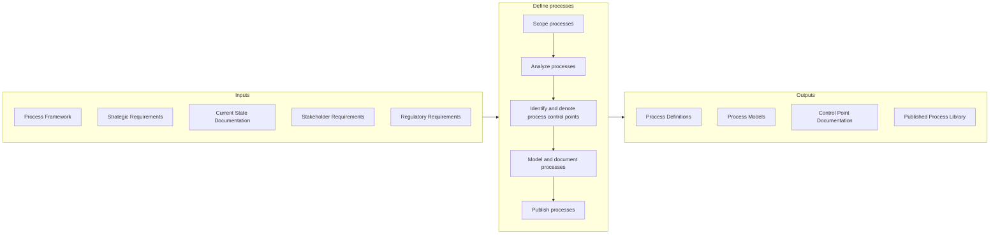

# Define processes

> Outlining and establishing the business processes of the organization.

## Overview

Process 13.1.3 is a core process that defines the specific procedures for defining business processes. This process transforms the abstract process framework into concrete, actionable process definitions that guide how work is performed across the organization.

Process definition encompasses scoping processes to determine boundaries and interfaces, analyzing processes to understand current performance and improvement opportunities, identifying control points for quality and compliance, modeling and documenting processes using standard notation, and publishing processes for consumption by stakeholders.

Well-defined processes provide clarity for employees, enable consistent execution, support training and onboarding, facilitate automation, and create the foundation for continuous improvement. This process works in concert with process frameworks (13.1.2) and process performance management (13.1.4) to create a comprehensive process management capability.

## Process Hierarchy



## Key Statistics

| Metric | Value |
|--------|-------|
| APQC Code | 16387 |
| Hierarchy ID | 13.1.3 |
| Level | Process |
| Parent | [13.1](../) |
| Sub-Processes | 5 |


## GraphDL Semantic Structure

```graphdl
define.Processes
```

| Component | Value | Description |
|-----------|-------|-------------|
| Verb | `define` | Primary action |
| Object | `processes` | Direct object |


## Process Flow



## Child Processes

### 13.1.3.1 Scope Processes

Defining the extent and limits of business processes. This activity establishes clear boundaries for what is included in each process, identifying start and end points, inputs and outputs, and interfaces with other processes.

**Key Activities:**
- Define process boundaries and triggers
- Identify process inputs, outputs, and interfaces
- Establish process scope statements
- Determine process stakeholders and participants

[View Process Details](./ScopeProcesses)

### 13.1.3.2 Analyze Processes

Assessing and examining the set of activities and tasks that, once completed, will accomplish an organizational goal. This activity creates business process models that capture how processes work and how individuals collaborate to achieve business objectives.

**Key Activities:**
- Gather current state process information
- Identify process performance gaps
- Analyze process dependencies and handoffs
- Identify best practices and improvement opportunities

[View Process Details](./13.1.3.2-AnalyzeProcesses/)

### 13.1.3.3 Identify and Denote Process Control Points

Establishment of checkpoints in processes that prevent continuation unless all requirements are met. Control points ensure quality, compliance, and risk management throughout process execution.

**Key Activities:**
- Identify critical quality control points
- Define approval and authorization requirements
- Establish compliance checkpoints
- Document control point criteria and escalation paths

[View Process Details](./IdentifyAndDenoteProcessControlPoints)

### 13.1.3.4 Model and Document Processes

Defining what a business entity does, who is responsible, to what standard a business process should be completed, and how success is determined. This activity creates the visual models and detailed documentation that describe process execution.

**Key Activities:**
- Create process flow diagrams using BPMN or similar notation
- Document process steps, roles, and responsibilities
- Define process metrics and success criteria
- Create supporting work instructions and procedures

[View Process Details](./ModelAndDocumentProcesses)

### 13.1.3.5 Publish Processes

Disclosing the information available on business processes to stakeholders who need it. This activity makes process documentation accessible and ensures it remains current and relevant.

**Key Activities:**
- Publish to process repository or knowledge base
- Establish version control and change management
- Communicate updates to stakeholders
- Ensure accessibility and searchability

[View Process Details](./PublishProcesses)


## RACI Matrix

| Activity | Responsible | Accountable | Consulted | Informed |
|----------|-------------|-------------|-----------|----------|
| Scope processes | Process Analyst | Process Owner | Subject Matter Experts | Stakeholders |
| Analyze processes | Process Analyst | Process Manager | Operations, Quality | Management |
| Identify control points | Process Analyst | Process Owner | Compliance, Risk | Auditors |
| Model processes | Process Analyst | Process Manager | IT, Operations | All employees |
| Document processes | Process Analyst | Process Owner | SMEs | Training |
| Publish processes | Process Team | Process Manager | Communications | All users |
| Review and approve | Process Owner | Process Director | Quality | Stakeholders |


## Metrics and KPIs

| Metric | Description | Target |
|--------|-------------|--------|
| Process Documentation Coverage | Percentage of key processes documented | 100% |
| Documentation Currency | Percentage of documents reviewed within cycle | >90% |
| Process Model Completeness | Processes with complete BPMN models | >85% |
| Control Point Coverage | Critical processes with defined controls | 100% |
| Time to Document | Average time to document new processes | <30 days |
| Documentation Quality Score | User satisfaction with documentation | >4.0/5.0 |
| Publication Accessibility | Process docs accessible to target audience | 100% |


## Related Departments

- [Operations](/departments/Operations) - Primary process execution and ownership
- [Quality](/departments/Quality) - Control point definition and compliance
- [Information Technology](/departments/IT) - Process automation and system integration
- [Compliance](/departments/Compliance) - Regulatory requirements and controls
- [Training](/departments/Training) - Process training materials


## Related Occupations

- [Business Process Analysts](/occupations/Business/ProcessAnalysts) - Process analysis and documentation
- [Management Analysts](/occupations/Business/ManagementAnalysts) - Process improvement consulting
- [Technical Writers](/occupations/Communications/TechnicalWriters) - Process documentation
- [Quality Control Analysts](/occupations/Business/QualityControl) - Control point design


## Industry Variations

### Manufacturing

Manufacturing process definition emphasizes detailed work instructions, quality control checkpoints, and integration with manufacturing execution systems (MES). Visual work instructions and standard operating procedures are common.

### Financial Services

Financial services require detailed audit trails, regulatory compliance checkpoints, and segregation of duties. Process documentation must satisfy regulatory examination requirements.

### Healthcare

Healthcare process definition integrates clinical protocols, patient safety requirements, and electronic health record workflows. Clinical pathways and care plans are specialized process artifacts.


## Process Modeling Standards

Common notation and standards for process documentation:

- **BPMN 2.0** - Business Process Model and Notation
- **Value Stream Mapping** - Lean process visualization
- **SIPOC** - Supplier, Input, Process, Output, Customer diagrams
- **Swimlane Diagrams** - Role-based process flows
- **EPC** - Event-driven Process Chains


---

*Source: APQC PCF 16387 (13.1.3) - APQC*
