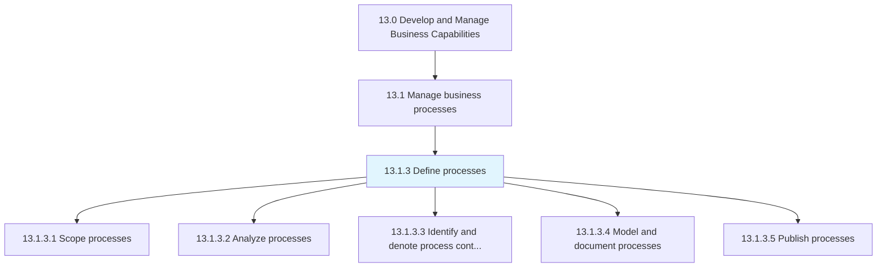
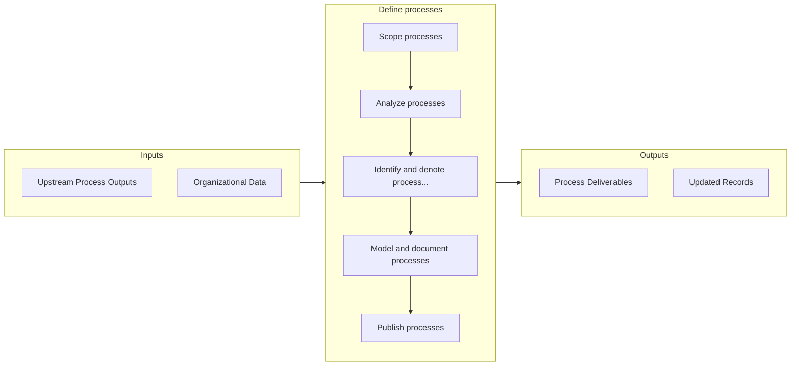

# Define processes

> Outlining and establishing the business processes of the organization.

## Overview

Process 13.1.3 is a core process that defines the specific procedures for define processes. 

Outlining and establishing the business processes of the organization. Scope, analyze, map, and publish processes for the employees who may require it.

## Process Hierarchy



## Key Statistics

| Metric | Value |
|--------|-------|
| APQC Code | 16387 |
| Hierarchy ID | 13.1.3 |
| Level | Process |
| Parent | [13.1](../) |
| Sub-Processes | 5 |


## GraphDL Semantic Structure

```
define.Processes
```

| Component | Value | Description |
|-----------|-------|-------------|
| Verb | `define` | Primary action |
| Object | `processes` | Direct object |


## Process Flow



## Sub-Processes

| Process | Hierarchy ID | Description |
|---------|-------------|-------------|
| [Scope processes](./ScopeProcesses) | 13.1.3.1 | Defining the extent and limits of business processes |
| [Analyze processes](./13.1.3.2-AnalyzeProcesses/) | 13.1.3.2 | Assessing and examining the set of activities and tasks that, once completed, will accomplish an org |
| [Identify and denote process control points](./IdentifyAndDenoteProcessControlPoints) | 13.1.3.3 | Establishment of a "checkpoint" in a process that prevent the process from continuing unless all req |
| [Model and document processes](./ModelAndDocumentProcesses) | 13.1.3.4 | Defining what a business entity does, who is responsible, to what standard a business process should |
| [Publish processes](./PublishProcesses) | 13.1.3.5 | Disclosing the information available on business processes |


## Related Concepts

- Processes


---

*Source: APQC PCF 16387 (13.1.3) - APQC*
