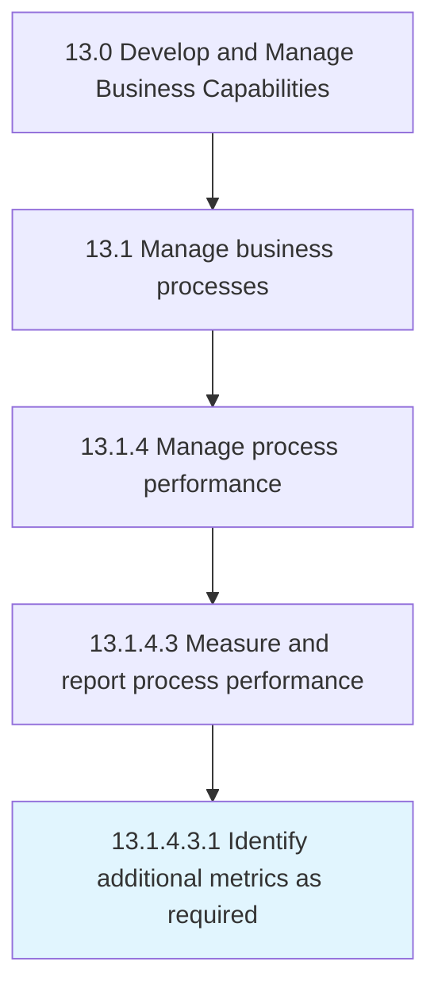

# Identify additional metrics as required

> Determining the need for additional performance indicators that would be necessary to successfully achieve the business goal.

## Overview

Sub-Activity 13.1.4.3.1 is an activity within the Develop and Manage Business Capabilities framework. 

Determining the need for additional performance indicators that would be necessary to successfully achieve the business goal.

## Process Hierarchy



## Key Statistics

| Metric | Value |
|--------|-------|
| APQC Code | 20141 |
| Hierarchy ID | 13.1.4.3.1 |
| Level | Sub-Activity |
| Parent | [13.1.4.3](../) |
| Sub-Processes | 0 |


## GraphDL Semantic Structure

```
identify.AdditionalMetricsAsRequired
```

| Component | Value | Description |
|-----------|-------|-------------|
| Verb | `identify` | Primary action |
| Object | `additional metrics as required` | Direct object |


## Related Concepts

- AdditionalMetricsAsRequired


---

*Source: APQC PCF 20141 (13.1.4.3.1) - APQC*
