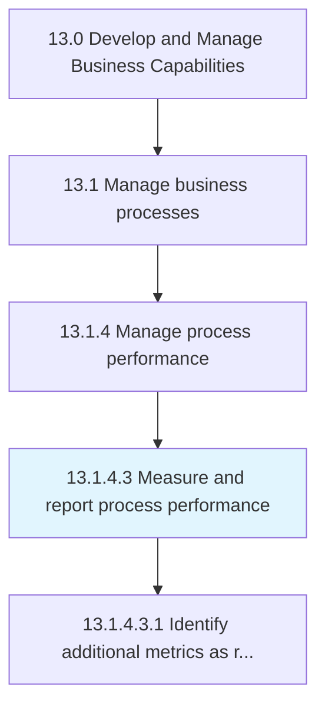
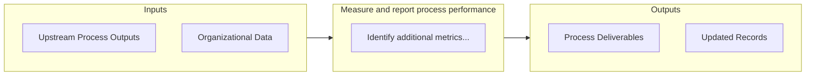

# Measure and report process performance

> Defining and using performance indicators to consider the financial perspective, customer perspective, internal process perspective, and learning perspective of the organization.

## Overview

Activity 13.1.4.3 is an activity within the Develop and Manage Business Capabilities framework. 

Defining and using performance indicators to consider the financial perspective, customer perspective, internal process perspective, and learning perspective of the organization.

## Process Hierarchy



## Key Statistics

| Metric | Value |
|--------|-------|
| APQC Code | 16395 |
| Hierarchy ID | 13.1.4.3 |
| Level | Activity |
| Parent | [13.1.4](../) |
| Sub-Processes | 1 |


## GraphDL Semantic Structure

```
measure.AndReportProcessPerformance
```

| Component | Value | Description |
|-----------|-------|-------------|
| Verb | `measure` | Primary action |
| Object | `and report process performance` | Direct object |


## Process Flow



## Sub-Processes

| Process | Hierarchy ID | Description |
|---------|-------------|-------------|
| [Identify additional metrics as required](./IdentifyAdditionalMetricsAsRequired) | 13.1.4.3.1 | Determining the need for additional performance indicators that would be necessary to successfully a |


## Related Concepts

- ProcessPerformance
- ProcessPerformance


---

*Source: APQC PCF 16395 (13.1.4.3) - APQC*
