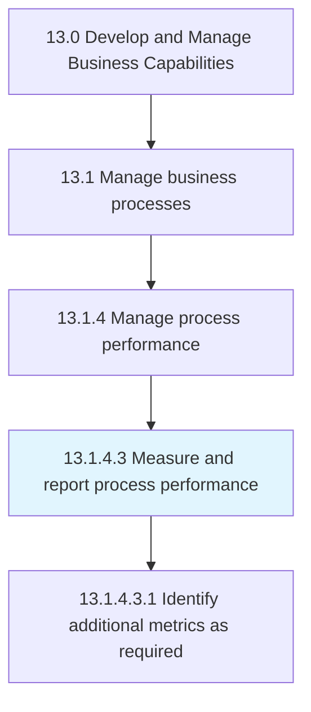
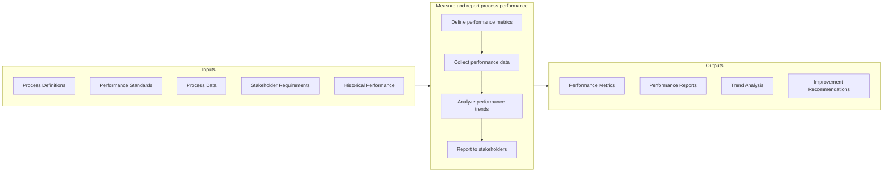

# Measure and report process performance

> Defining and using performance indicators to consider the financial perspective, customer perspective, internal process perspective, and learning perspective of the organization.

## Overview

Activity 13.1.4.3 is an activity within the Develop and Manage Business Capabilities framework. This activity establishes the measurement systems and reporting mechanisms needed to track process performance and enable data-driven improvement decisions.

Process performance measurement creates visibility into how well business processes are executing against defined standards and objectives. It addresses multiple perspectives - financial efficiency, customer satisfaction, internal process effectiveness, and learning/growth - to provide a holistic view of process health.

Effective measurement and reporting enables proactive process management by identifying performance trends, highlighting emerging issues, and demonstrating the impact of improvement initiatives. It transforms raw process data into actionable insights that drive continuous improvement.

## Process Hierarchy



## Key Statistics

| Metric | Value |
|--------|-------|
| APQC Code | 16395 |
| Hierarchy ID | 13.1.4.3 |
| Level | Activity |
| Parent | [13.1.4](../) |
| Sub-Processes | 1 |


## GraphDL Semantic Structure

```graphdl
measure.ProcessPerformance.and.ReportProcessPerformance
```

| Component | Value | Description |
|-----------|-------|-------------|
| Verb | `measure` | Primary action of collecting data |
| Object | `process performance` | Performance metrics |
| Preposition | `and` | Conjunction linking actions |
| PrepObject | `report process performance` | Communicating results |


## Process Flow



## Child Processes

### 13.1.4.3.1 Identify Additional Metrics as Required

Determining the need for additional performance indicators that would be necessary to successfully achieve business goals. This sub-activity ensures that the metric set evolves with changing business needs.

**Key Activities:**
- Assess metric coverage against objectives
- Identify measurement gaps
- Define new metrics as needed
- Validate metric relevance with stakeholders
- Retire obsolete metrics

[View Process Details](./IdentifyAdditionalMetricsAsRequired)


## RACI Matrix

| Activity | Responsible | Accountable | Consulted | Informed |
|----------|-------------|-------------|-----------|----------|
| Define performance metrics | Process Analyst | Process Manager | Process Owners | Stakeholders |
| Establish data collection | Data Analyst | Process Manager | IT | Operations |
| Collect performance data | Operations | Process Analyst | IT | Management |
| Analyze performance trends | Business Analyst | Process Manager | Quality | Stakeholders |
| Create performance reports | Process Analyst | Process Manager | Communications | All stakeholders |
| Identify additional metrics | Process Analyst | Process Manager | Business Leaders | Teams |


## Metrics and KPIs

| Metric | Description | Target |
|--------|-------------|--------|
| Metric Coverage | Key processes with defined metrics | 100% |
| Data Quality | Accuracy and completeness of data | >98% |
| Reporting Timeliness | Reports delivered on schedule | 100% |
| Metric Actionability | Metrics driving improvement actions | >75% |
| Stakeholder Satisfaction | User satisfaction with reports | >4.0/5.0 |
| Report Automation | Automated vs. manual reporting | >80% automated |


## Related Departments

- [Operations](/departments/Operations) - Process data and performance
- [Information Technology](/departments/IT) - Data systems and automation
- [Finance](/departments/Finance) - Financial metrics
- [Quality](/departments/Quality) - Quality performance metrics


## Related Occupations

- [Business Intelligence Analysts](/occupations/Business/BIAnalysts) - Analytics and reporting
- [Business Process Analysts](/occupations/Business/ProcessAnalysts) - Process metrics
- [Data Analysts](/occupations/Business/DataAnalysts) - Data collection and analysis
- [Management Analysts](/occupations/Business/ManagementAnalysts) - Performance consulting


## Balanced Scorecard Perspectives

Process performance measurement addresses multiple perspectives:

### Financial Perspective
- Process cost efficiency
- Resource utilization
- Cost of quality
- Financial impact of process issues

### Customer Perspective
- Customer satisfaction with process
- Service level achievement
- Response and cycle times
- Customer effort scores

### Internal Process Perspective
- Process cycle time
- Throughput and capacity
- Error and rework rates
- Compliance and adherence

### Learning and Growth Perspective
- Process training effectiveness
- Capability development
- Innovation and improvement
- Knowledge capture and reuse


## Reporting Best Practices

- **Relevance** - Report metrics that matter to audience
- **Timeliness** - Deliver information when needed
- **Accuracy** - Ensure data quality and validation
- **Clarity** - Present information accessibly
- **Actionability** - Enable decisions and actions
- **Automation** - Reduce manual reporting burden


---

*Source: APQC PCF 16395 (13.1.4.3) - APQC*
