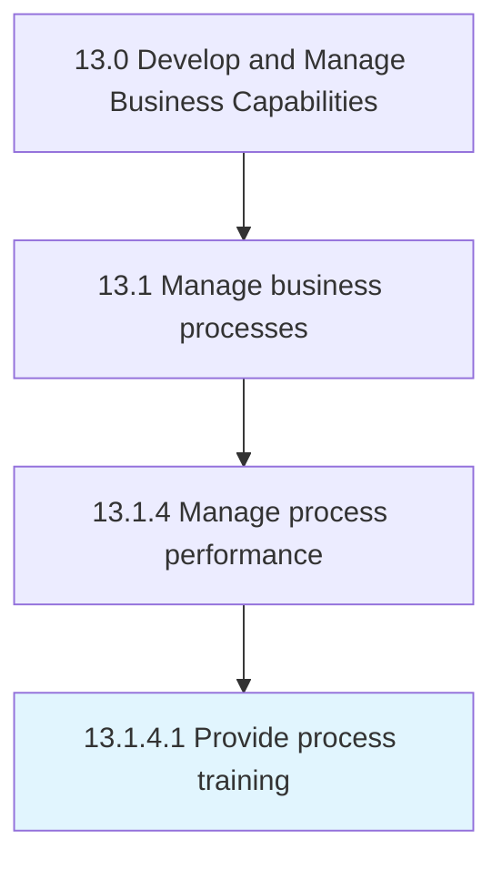

# Provide process training

> Providing training for the employees and process owners that administer the business processes.

## Overview

Activity 13.1.4.1 is an activity within the Develop and Manage Business Capabilities framework. 

Providing training for the employees and process owners that administer the business processes. Design internal training programs or source third party agencies to provide the skills and training necessary.

## Process Hierarchy



## Key Statistics

| Metric | Value |
|--------|-------|
| APQC Code | 16393 |
| Hierarchy ID | 13.1.4.1 |
| Level | Activity |
| Parent | [13.1.4](../) |
| Sub-Processes | 0 |


## GraphDL Semantic Structure

```
provide.ProcessTraining
```

| Component | Value | Description |
|-----------|-------|-------------|
| Verb | `provide` | Primary action |
| Object | `process training` | Direct object |


## Related Concepts

- ProcessTraining


---

*Source: APQC PCF 16393 (13.1.4.1) - APQC*
