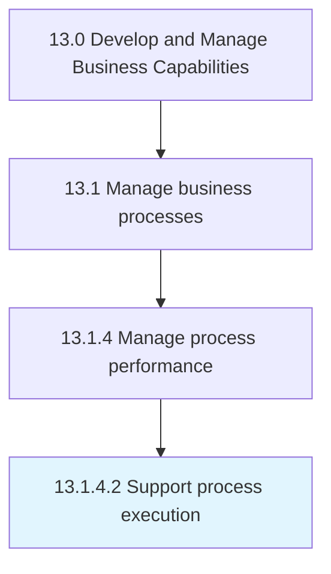

# Support process execution

> Assisting and executing the business processes.

## Overview

Activity 13.1.4.2 is an activity within the Develop and Manage Business Capabilities framework. 

Assisting and executing the business processes. Use business process execution language (BEPL), which is a standard, executable language for specifying actions within the business processes with the use of web services.

## Process Hierarchy



## Key Statistics

| Metric | Value |
|--------|-------|
| APQC Code | 16394 |
| Hierarchy ID | 13.1.4.2 |
| Level | Activity |
| Parent | [13.1.4](../) |
| Sub-Processes | 0 |


## GraphDL Semantic Structure

```
support.ProcessExecution
```

| Component | Value | Description |
|-----------|-------|-------------|
| Verb | `support` | Primary action |
| Object | `process execution` | Direct object |


## Related Concepts

- ProcessExecution


---

*Source: APQC PCF 16394 (13.1.4.2) - APQC*
