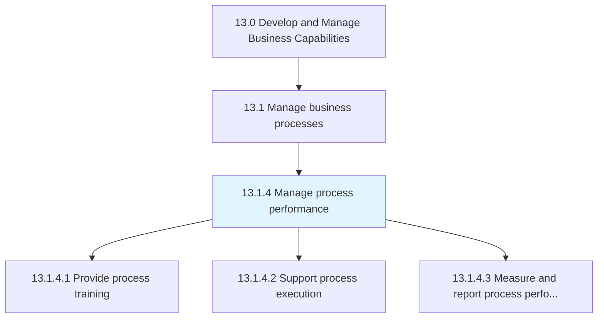
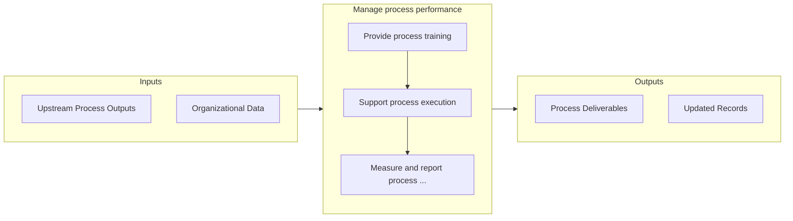

# Manage process performance

> Evaluating and handling the performance of business processes.

## Overview

Process 13.1.4 is a core process that defines the specific procedures for manage process performance. 

Evaluating and handling the performance of business processes. Provide training to process owners. Support the execution of business processes. Measure and report the performance of the business processes.

## Process Hierarchy



## Key Statistics

| Metric | Value |
|--------|-------|
| APQC Code | 16392 |
| Hierarchy ID | 13.1.4 |
| Level | Process |
| Parent | [13.1](../) |
| Sub-Processes | 3 |


## GraphDL Semantic Structure

```graphdl
manage.ProcessPerformance
```

| Component | Value | Description |
|-----------|-------|-------------|
| Verb | `manage` | Primary action |
| Object | `process performance` | Direct object |


## Process Flow



## Sub-Processes

| Process | Hierarchy ID | Description |
|---------|-------------|-------------|
| [Provide process training](./ProvideProcessTraining) | 13.1.4.1 | Providing training for the employees and process owners that administer the business processes |
| [Support process execution](./SupportProcessExecution) | 13.1.4.2 | Assisting and executing the business processes |
| [Measure and report process performance](./13.1.4.3-MeasureReportProcessPerformance/) | 13.1.4.3 | Defining and using performance indicators to consider the financial perspective, customer perspectiv |


## Related Concepts

- ProcessPerformance


---

*Source: APQC PCF 16392 (13.1.4) - APQC*
