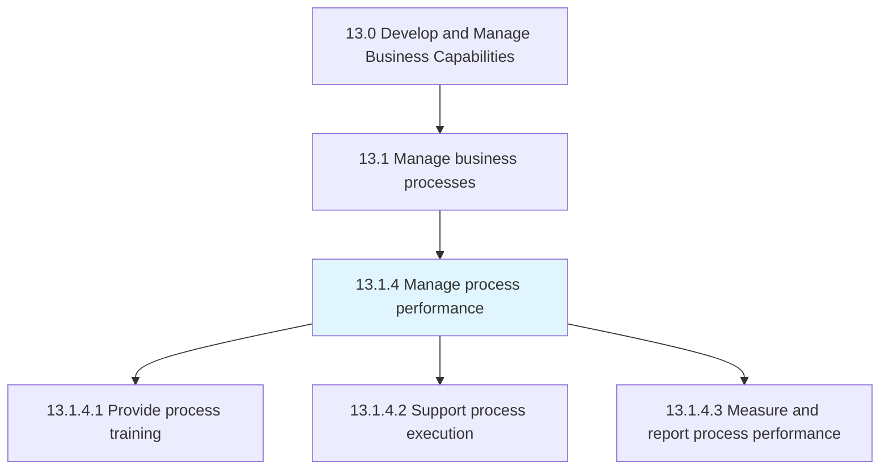
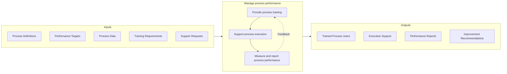

# Manage process performance

> Evaluating and handling the performance of business processes.

## Overview

Process 13.1.4 is a core process that defines the specific procedures for managing process performance. This process ensures that defined business processes are executed effectively and that performance is continuously monitored and improved.

Managing process performance encompasses three key activities: providing training to process owners and participants to ensure they have the knowledge and skills to execute processes correctly, supporting process execution to address issues and provide guidance, and measuring and reporting process performance to enable data-driven decision making and continuous improvement.

Effective process performance management creates a feedback loop that connects process definition with process improvement. By systematically measuring how processes perform against defined standards and targets, organizations can identify performance gaps, root causes, and improvement opportunities. This process works in conjunction with enterprise quality management (13.3) and measurement and benchmarking (13.6) capabilities.

## Process Hierarchy



## Key Statistics

| Metric | Value |
|--------|-------|
| APQC Code | 16392 |
| Hierarchy ID | 13.1.4 |
| Level | Process |
| Parent | [13.1](../) |
| Sub-Processes | 3 |


## GraphDL Semantic Structure

```graphdl
manage.ProcessPerformance
```

| Component | Value | Description |
|-----------|-------|-------------|
| Verb | `manage` | Primary action |
| Object | `process performance` | Direct object |


## Process Flow



## Child Processes

### 13.1.4.1 Provide Process Training

Providing training for the employees and process owners that administer the business processes. This activity ensures that all process participants have the knowledge and skills required for effective process execution.

**Key Activities:**
- Develop process-specific training materials
- Deliver training programs for process owners and users
- Certify process competency where required
- Maintain training records and compliance
- Update training as processes evolve

[View Process Details](./ProvideProcessTraining)

### 13.1.4.2 Support Process Execution

Assisting and executing the business processes. This activity provides ongoing support to process participants, addressing questions, resolving issues, and ensuring smooth process operation.

**Key Activities:**
- Provide process help desk and support services
- Address process exceptions and escalations
- Facilitate cross-functional process coordination
- Resolve process bottlenecks and issues
- Maintain process support documentation

[View Process Details](./SupportProcessExecution)

### 13.1.4.3 Measure and Report Process Performance

Defining and using performance indicators to consider the financial perspective, customer perspective, internal process perspective, and learning perspective of the organization. This activity provides the measurement and reporting capabilities that enable data-driven process management.

**Key Activities:**
- Define process performance metrics and KPIs
- Collect and analyze process performance data
- Create process performance dashboards and reports
- Identify performance gaps and trends
- Recommend process improvements

[View Process Details](./13.1.4.3-MeasureReportProcessPerformance/)


## RACI Matrix

| Activity | Responsible | Accountable | Consulted | Informed |
|----------|-------------|-------------|-----------|----------|
| Develop training materials | Training Team | Process Manager | Process Owners | HR |
| Deliver process training | Trainers | Training Manager | Process Owners | Participants |
| Provide process support | Support Team | Process Manager | SMEs | Users |
| Resolve process issues | Process Analyst | Process Owner | Operations | Management |
| Define performance metrics | Process Analyst | Process Manager | Quality, Finance | Stakeholders |
| Collect performance data | Data Analysts | Process Analyst | IT | Process Owners |
| Report process performance | Process Analyst | Process Manager | Management | All stakeholders |
| Recommend improvements | Process Analyst | Process Owner | Quality | Executive team |


## Metrics and KPIs

| Metric | Description | Target |
|--------|-------------|--------|
| Training Completion Rate | Percentage of users completing required training | 100% |
| Training Effectiveness | Post-training competency assessment scores | >85% |
| Support Ticket Resolution Time | Average time to resolve process support requests | <4 hours |
| Process Compliance Rate | Adherence to defined process steps | >95% |
| Process Cycle Time | Average time to complete process instances | Within SLA |
| Process Error Rate | Frequency of process execution errors | <2% |
| Performance Report Timeliness | Reports delivered on schedule | 100% |
| Improvement Action Completion | Percentage of improvement actions implemented | >80% |


## Related Departments

- [Operations](/departments/Operations) - Process execution and performance ownership
- [Training](/departments/Training) - Training program development and delivery
- [Quality](/departments/Quality) - Performance standards and compliance
- [Information Technology](/departments/IT) - Performance data systems and analytics
- [Human Resources](/departments/HR) - Training administration and records


## Related Occupations

- [Training and Development Specialists](/occupations/HR/TrainingSpecialists) - Training program development
- [Business Process Analysts](/occupations/Business/ProcessAnalysts) - Performance analysis
- [Management Analysts](/occupations/Business/ManagementAnalysts) - Process improvement consulting
- [Quality Control Analysts](/occupations/Business/QualityControl) - Performance measurement
- [Business Intelligence Analysts](/occupations/Business/BIAnalysts) - Performance reporting


## Industry Variations

### Manufacturing

Manufacturing process performance emphasizes operational efficiency metrics like OEE, cycle time, and defect rates. Real-time process monitoring through MES systems is common. Performance is often displayed on shop floor dashboards.

### Financial Services

Financial services focus on transaction accuracy, processing time, and regulatory compliance. Process controls and audit trails are critical. Performance reporting supports regulatory examinations.

### Healthcare

Healthcare process performance includes clinical outcomes, patient safety metrics, and operational efficiency. Performance measurement supports value-based care models and quality reporting requirements.


## Balanced Scorecard Perspectives

Process performance measurement typically addresses multiple perspectives:

- **Financial** - Cost efficiency, resource utilization, financial impact
- **Customer** - Service quality, responsiveness, satisfaction
- **Internal Process** - Cycle time, accuracy, compliance, throughput
- **Learning & Growth** - Training effectiveness, capability development


---

*Source: APQC PCF 16392 (13.1.4) - APQC*
