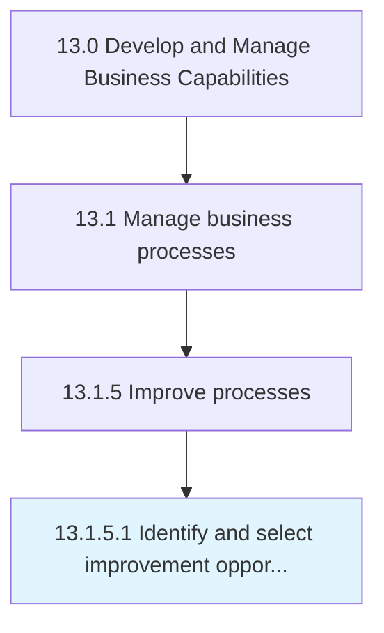

# Identify and select improvement opportunities

> Helping a process owner to identify, analyze, and improve existing business processes within an organization to meet new goals and objectives.

## Overview

Activity 13.1.5.1 is an activity within the Develop and Manage Business Capabilities framework. 

Helping a process owner to identify, analyze, and improve existing business processes within an organization to meet new goals and objectives.

## Process Hierarchy



## Key Statistics

| Metric | Value |
|--------|-------|
| APQC Code | 16397 |
| Hierarchy ID | 13.1.5.1 |
| Level | Activity |
| Parent | [13.1.5](../) |
| Sub-Processes | 0 |


## GraphDL Semantic Structure

```
identify.AndSelectImprovementOpportunities
```

| Component | Value | Description |
|-----------|-------|-------------|
| Verb | `identify` | Primary action |
| Object | `and select improvement opportunities` | Direct object |


## Related Concepts

- [ImprovementOpportunities](/concepts/ImprovementOpportunities)
- [ImprovementOpportunities](/concepts/ImprovementOpportunities)


---

*Source: APQC PCF 16397 (13.1.5.1) - APQC*
