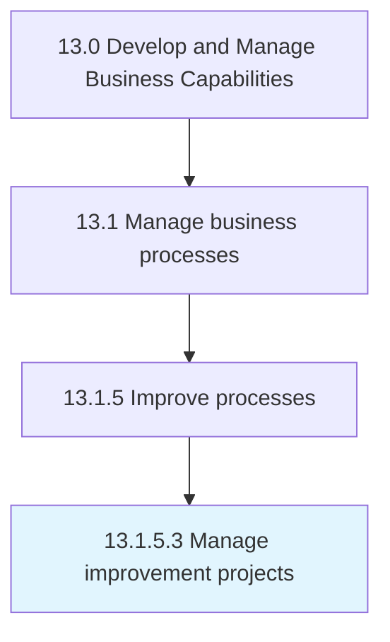

# Manage improvement projects

> Developing and implementing a systematic approach to help the organization optimize its underlying processes in order to achieve more efficient results.

## Overview

Activity 13.1.5.3 is an activity within the Develop and Manage Business Capabilities framework. 

Developing and implementing a systematic approach to help the organization optimize its underlying processes in order to achieve more efficient results. Systematically gather information to clarify issues or problems. Intervene for improvements. Restructure training programs as appropriate to increase effectiveness.

## Process Hierarchy



## Key Statistics

| Metric | Value |
|--------|-------|
| APQC Code | 16398 |
| Hierarchy ID | 13.1.5.3 |
| Level | Activity |
| Parent | [13.1.5](../) |
| Sub-Processes | 0 |


## GraphDL Semantic Structure

```
manage.ImprovementProjects
```

| Component | Value | Description |
|-----------|-------|-------------|
| Verb | `manage` | Primary action |
| Object | `improvement projects` | Direct object |


## Related Concepts

- [ImprovementProjects](/concepts/ImprovementProjects)


---

*Source: APQC PCF 16398 (13.1.5.3) - APQC*
