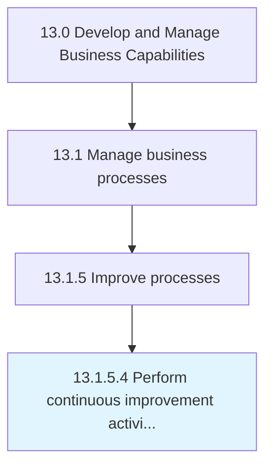

# Perform continuous improvement activities

> Persistently implementing activities for improving business processes.

## Overview

Activity 13.1.5.4 is an activity within the Develop and Manage Business Capabilities framework. 

Persistently implementing activities for improving business processes.

## Process Hierarchy



## Key Statistics

| Metric | Value |
|--------|-------|
| APQC Code | 16399 |
| Hierarchy ID | 13.1.5.4 |
| Level | Activity |
| Parent | [13.1.5](../) |
| Sub-Processes | 0 |


## GraphDL Semantic Structure

```
perform.ContinuousImprovementActivities
```

| Component | Value | Description |
|-----------|-------|-------------|
| Verb | `perform` | Primary action |
| Object | `continuous improvement activities` | Direct object |


## Related Concepts

- [ContinuousImprovementActivities](/concepts/ContinuousImprovementActivities)


---

*Source: APQC PCF 16399 (13.1.5.4) - APQC*
