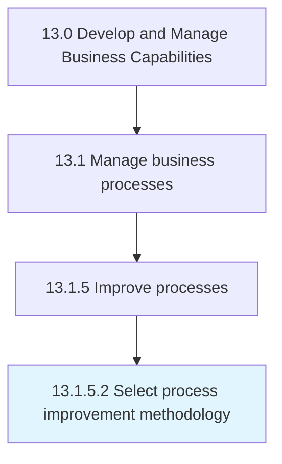

# Select process improvement methodology

> Assessing and choosing methodologies to identify, analyze, and improve existing processes within an organization to meet new goals and objective.

## Overview

Activity 13.1.5.2 is an activity within the Develop and Manage Business Capabilities framework. 

Assessing and choosing methodologies to identify, analyze, and improve existing processes within an organization to meet new goals and objective. Assess the various methodologies available such as process mapping, statistical process control, and simulation. Choose the most appropriate and effective methodology.

## Process Hierarchy



## Key Statistics

| Metric | Value |
|--------|-------|
| APQC Code | 11138 |
| Hierarchy ID | 13.1.5.2 |
| Level | Activity |
| Parent | [13.1.5](../) |
| Sub-Processes | 0 |


## GraphDL Semantic Structure

```
select.ProcessImprovementMethodology
```

| Component | Value | Description |
|-----------|-------|-------------|
| Verb | `select` | Primary action |
| Object | `process improvement methodology` | Direct object |


## Related Concepts

- [ProcessImprovementMethodology](/concepts/ProcessImprovementMethodology)


---

*Source: APQC PCF 11138 (13.1.5.2) - APQC*
