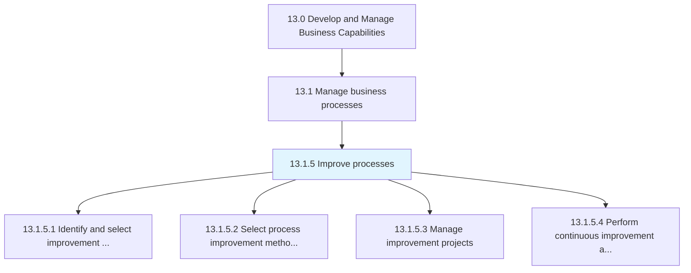
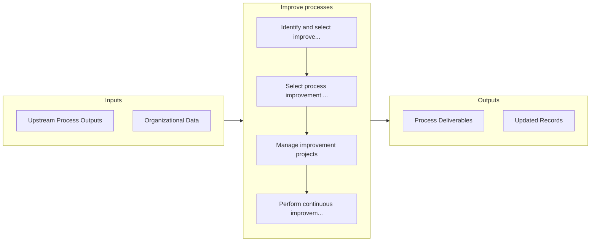

# Improve processes

> Identifying, selecting, and managing improvements.

## Overview

Process 13.1.5 is a core process that defines the specific procedures for improve processes. 

Identifying, selecting, and managing improvements. Based on the type and scope of the improvement, determination of the appropriate improvement methodology (e.g., Lean, Six Sigma, etc.) should guide the effort. This includes continuous improvement, process redesign, process reengineering, and application of the organizations approaches for Manage projects.

## Process Hierarchy



## Key Statistics

| Metric | Value |
|--------|-------|
| APQC Code | 21453 |
| Hierarchy ID | 13.1.5 |
| Level | Process |
| Parent | [13.1](../) |
| Sub-Processes | 4 |


## GraphDL Semantic Structure

```
improve.Processes
```

| Component | Value | Description |
|-----------|-------|-------------|
| Verb | `improve` | Primary action |
| Object | `processes` | Direct object |


## Process Flow



## Sub-Processes

| Process | Hierarchy ID | Description |
|---------|-------------|-------------|
| [Identify and select improvement opportunities](./IdentifyAndSelectImprovementOpportunities) | 13.1.5.1 | Helping a process owner to identify, analyze, and improve existing business processes within an orga |
| [Select process improvement methodology](./SelectProcessImprovementMethodology) | 13.1.5.2 | Assessing and choosing methodologies to identify, analyze, and improve existing processes within an  |
| [Manage improvement projects](./ManageImprovementProjects) | 13.1.5.3 | Developing and implementing a systematic approach to help the organization optimize its underlying p |
| [Perform continuous improvement activities](./PerformContinuousImprovementActivities) | 13.1.5.4 | Persistently implementing activities for improving business processes |


## Related Concepts

- [Processes](/concepts/Processes)


---

*Source: APQC PCF 21453 (13.1.5) - APQC*
