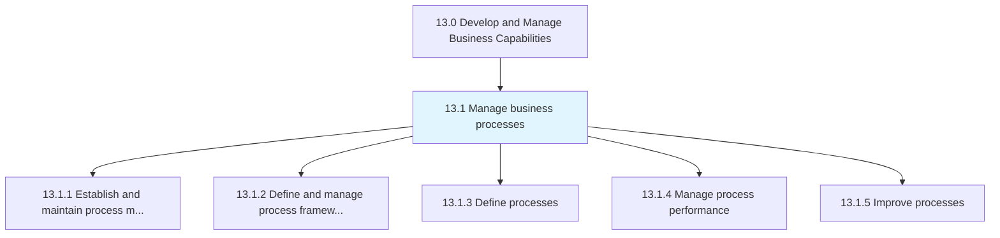
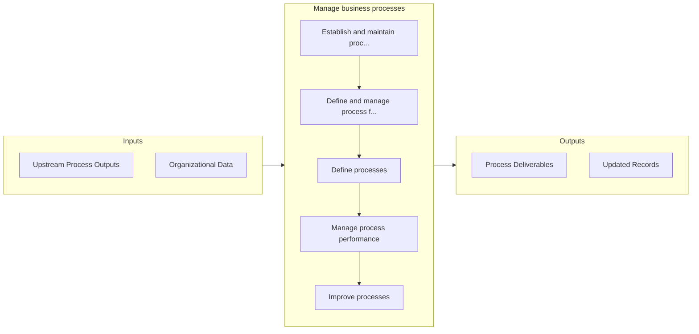

# Manage business processes

> Establishing and administering governance for management of the processes.

## Overview

Group 13.1 is a process group within APQC Category 13.0 (Develop and Manage Business Capabilities). 

Establishing and administering governance for management of the processes. Outline and manage the frameworks for management of the processes. Define the business processes. Administer the performance of the processes. Enhance the business processes.

## Process Hierarchy



## Key Statistics

| Metric | Value |
|--------|-------|
| APQC Code | 16378 |
| Hierarchy ID | 13.1 |
| Level | Group |
| Parent | [13](../) |
| Sub-Processes | 5 |


## GraphDL Semantic Structure

```
manage.BusinessProcesses
```

| Component | Value | Description |
|-----------|-------|-------------|
| Verb | `manage` | Primary action |
| Object | `business processes` | Direct object |


## Process Flow



## Sub-Processes

| Process | Hierarchy ID | Description |
|---------|-------------|-------------|
| [Establish and maintain process management governance](./13.1.1-EstablishMaintainProcessManagement/) | 13.1.1 | Defining and managing the organization's approach to governing business process management |
| [Define and manage process frameworks](./13.1.2-DefineManageProcessFrameworks/) | 13.1.2 | Determining and organizing the structural composition of business processes |
| [Define processes](./13.1.3-DefineProcesses/) | 13.1.3 | Outlining and establishing the business processes of the organization |
| [Manage process performance](./13.1.4-ManageProcessPerformance/) | 13.1.4 | Evaluating and handling the performance of business processes |
| [Improve processes](./13.1.5-ImproveProcesses/) | 13.1.5 | Identifying, selecting, and managing improvements |


## Related Concepts

- BusinessProcesses


---

*Source: APQC PCF 16378 (13.1) - APQC*
