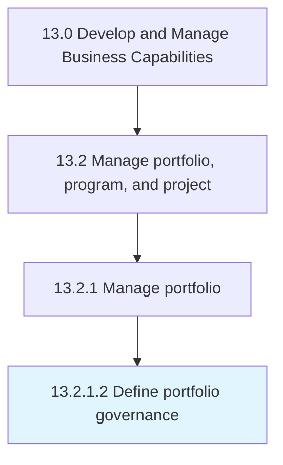

# Define portfolio governance

> Outlining the administration of business portfolio of the organization.

## Overview

Activity 13.2.1.2 is an activity within the Develop and Manage Business Capabilities framework. 

Outlining the administration of business portfolio of the organization. Create and manage the rules and regulations regarding the business processes in order to identify, select, prioritize, and monitor portfolio components. Include a set of metrics to indicate the health and progress of the portfolio in the most vital area.

## Process Hierarchy



## Key Statistics

| Metric | Value |
|--------|-------|
| APQC Code | 16403 |
| Hierarchy ID | 13.2.1.2 |
| Level | Activity |
| Parent | [13.2.1](../) |
| Sub-Processes | 0 |


## GraphDL Semantic Structure

```
define.PortfolioGovernance
```

| Component | Value | Description |
|-----------|-------|-------------|
| Verb | `define` | Primary action |
| Object | `portfolio governance` | Direct object |


## Related Concepts

- PortfolioGovernance


---

*Source: APQC PCF 16403 (13.2.1.2) - APQC*
