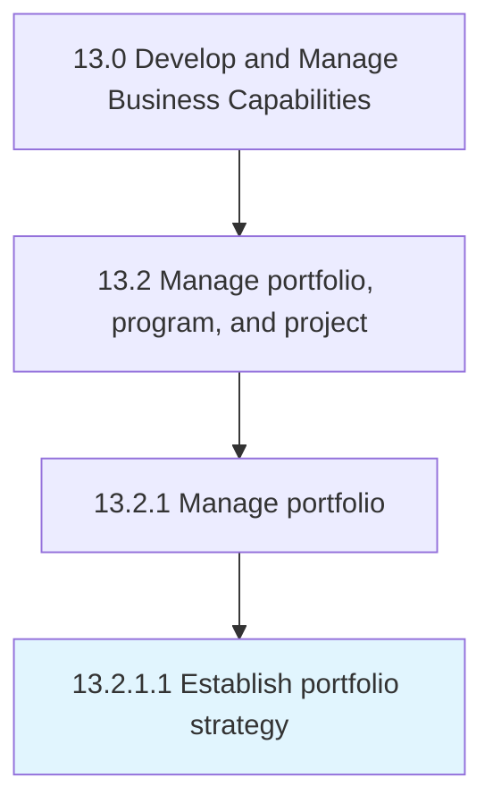

# Establish portfolio strategy

> Instituting the strategy for managing business portfolio.

## Overview

Activity 13.2.1.1 is an activity within the Develop and Manage Business Capabilities framework. 

Instituting the strategy for managing business portfolio. Create a systematic plan that defines the strategy for managing investments, holdings, products, businesses, and brands.

## Process Hierarchy



## Key Statistics

| Metric | Value |
|--------|-------|
| APQC Code | 16402 |
| Hierarchy ID | 13.2.1.1 |
| Level | Activity |
| Parent | [13.2.1](../) |
| Sub-Processes | 0 |


## GraphDL Semantic Structure

```
establish.PortfolioStrategy
```

| Component | Value | Description |
|-----------|-------|-------------|
| Verb | `establish` | Primary action |
| Object | `portfolio strategy` | Direct object |


## Related Concepts

- PortfolioStrategy


---

*Source: APQC PCF 16402 (13.2.1.1) - APQC*
