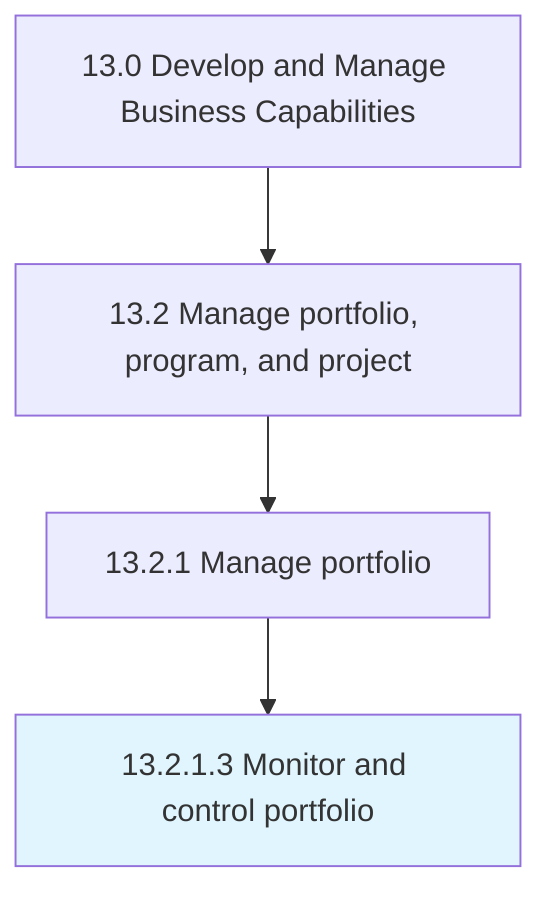

# Monitor and control portfolio

> Overseeing and administering the business portfolio of the organization.

## Overview

Activity 13.2.1.3 is an activity within the Develop and Manage Business Capabilities framework. 

Overseeing and administering the business portfolio of the organization. Monitor all activities related to investments, holdings, products, businesses, and brands by effectively monitoring and supervising these activities.

## Process Hierarchy



## Key Statistics

| Metric | Value |
|--------|-------|
| APQC Code | 16404 |
| Hierarchy ID | 13.2.1.3 |
| Level | Activity |
| Parent | [13.2.1](../) |
| Sub-Processes | 0 |


## GraphDL Semantic Structure

```
monitor.AndControlPortfolio
```

| Component | Value | Description |
|-----------|-------|-------------|
| Verb | `monitor` | Primary action |
| Object | `and control portfolio` | Direct object |


## Related Concepts

- [Portfolio](/concepts/Portfolio)
- [Portfolio](/concepts/Portfolio)


---

*Source: APQC PCF 16404 (13.2.1.3) - APQC*
