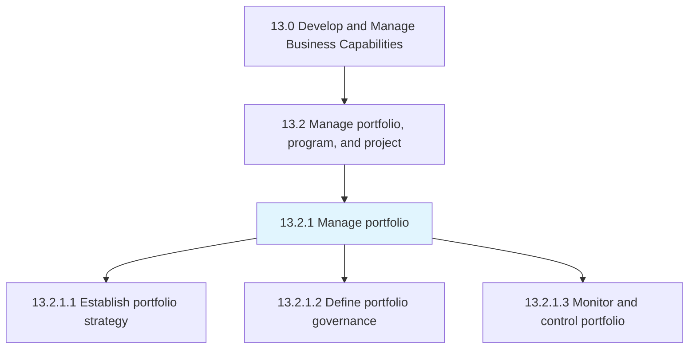
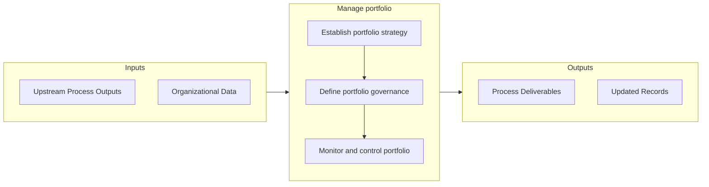

# Manage portfolio

> Managing the business portfolio of the organization, including investments, holdings, products, businesses, and brands.

## Overview

Process 13.2.1 is a core process that defines the specific procedures for manage portfolio. 

Managing the business portfolio of the organization, including investments, holdings, products, businesses, and brands. Establish a portfolio strategy. Define portfolio governance. Monitor and control the portfolio.

## Process Hierarchy



## Key Statistics

| Metric | Value |
|--------|-------|
| APQC Code | 16401 |
| Hierarchy ID | 13.2.1 |
| Level | Process |
| Parent | [13.2](../) |
| Sub-Processes | 3 |


## GraphDL Semantic Structure

```graphdl
manage.Portfolio
```

| Component | Value | Description |
|-----------|-------|-------------|
| Verb | `manage` | Primary action |
| Object | `portfolio` | Direct object |


## Process Flow



## Sub-Processes

| Process | Hierarchy ID | Description |
|---------|-------------|-------------|
| [Establish portfolio strategy](./EstablishPortfolioStrategy) | 13.2.1.1 | Instituting the strategy for managing business portfolio |
| [Define portfolio governance](./DefinePortfolioGovernance) | 13.2.1.2 | Outlining the administration of business portfolio of the organization |
| [Monitor and control portfolio](./MonitorAndControlPortfolio) | 13.2.1.3 | Overseeing and administering the business portfolio of the organization |


## Related Concepts

- Portfolio


---

*Source: APQC PCF 16401 (13.2.1) - APQC*
