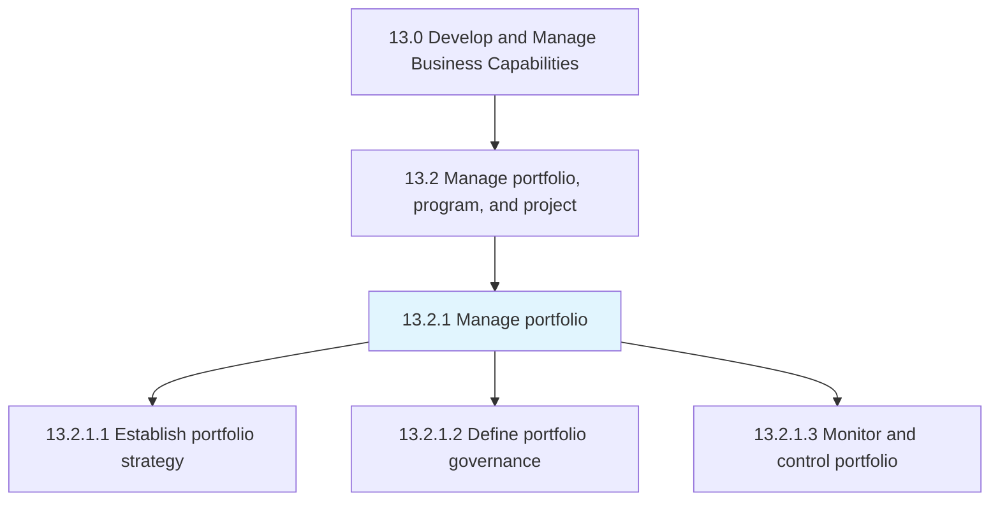
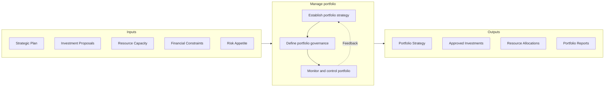

# Manage portfolio

> Managing the business portfolio of the organization, including investments, holdings, products, businesses, and brands.

## Overview

Process 13.2.1 is a core process that defines the specific procedures for managing the business portfolio. Portfolio management ensures that the organization's collection of programs, projects, and investments is optimally aligned with strategic objectives and that resources are allocated to maximize overall value.

Portfolio management operates at a strategic level, above individual programs and projects. It provides the governance framework for evaluating potential investments, prioritizing initiatives, balancing the portfolio mix, and making go/no-go decisions. Effective portfolio management ensures that the organization invests in the right initiatives and maintains an appropriate balance of risk and return across its portfolio.

This process encompasses establishing the portfolio strategy that guides investment decisions, defining governance structures and decision rights, and implementing ongoing monitoring and control mechanisms to track portfolio health and performance.

## Process Hierarchy



## Key Statistics

| Metric | Value |
|--------|-------|
| APQC Code | 16401 |
| Hierarchy ID | 13.2.1 |
| Level | Process |
| Parent | [13.2](../) |
| Sub-Processes | 3 |


## GraphDL Semantic Structure

```graphdl
manage.Portfolio
```

| Component | Value | Description |
|-----------|-------|-------------|
| Verb | `manage` | Primary action |
| Object | `portfolio` | Direct object |


## Process Flow



## Child Processes

### 13.2.1.1 Establish Portfolio Strategy

Instituting the strategy for managing the business portfolio. This activity defines the investment themes, priorities, and criteria that guide portfolio composition and decision-making.

**Key Activities:**
- Define portfolio investment themes aligned with strategy
- Establish portfolio balancing criteria (risk, return, timing)
- Set investment thresholds and approval limits
- Define portfolio performance targets
- Align portfolio strategy with business planning cycles

[View Process Details](./EstablishPortfolioStrategy)

### 13.2.1.2 Define Portfolio Governance

Outlining the administration of business portfolio of the organization. This activity establishes the decision-making structures, roles, and processes that govern portfolio management.

**Key Activities:**
- Define portfolio governance structure and committees
- Establish decision rights and approval authorities
- Create portfolio evaluation and prioritization criteria
- Define portfolio reporting requirements
- Establish escalation and exception processes

[View Process Details](./DefinePortfolioGovernance)

### 13.2.1.3 Monitor and Control Portfolio

Overseeing and administering the business portfolio of the organization. This activity provides ongoing visibility into portfolio health and enables timely intervention when needed.

**Key Activities:**
- Track portfolio performance against targets
- Monitor initiative status and health indicators
- Conduct portfolio reviews and rebalancing
- Manage portfolio risks and dependencies
- Report portfolio status to stakeholders

[View Process Details](./MonitorAndControlPortfolio)


## RACI Matrix

| Activity | Responsible | Accountable | Consulted | Informed |
|----------|-------------|-------------|-----------|----------|
| Define portfolio strategy | Portfolio Manager | Chief Strategy Officer | Business Unit Heads | Executive team |
| Establish governance structure | Portfolio Manager | COO | Legal, Finance | All stakeholders |
| Evaluate investment proposals | Portfolio Analyst | Portfolio Manager | Finance, Risk | Sponsors |
| Approve portfolio investments | Portfolio Committee | CEO | CFO | Board |
| Allocate portfolio resources | Resource Manager | Portfolio Manager | Department Heads | Project Managers |
| Monitor portfolio performance | Portfolio Analyst | Portfolio Manager | PMO | Executive team |
| Rebalance portfolio | Portfolio Manager | Chief Strategy Officer | Finance | Stakeholders |
| Report portfolio status | Portfolio Analyst | Portfolio Manager | Finance | Board, Executives |


## Metrics and KPIs

| Metric | Description | Target |
|--------|-------------|--------|
| Portfolio ROI | Return on investment across portfolio | >20% |
| Strategic Alignment Score | Initiatives aligned with strategic themes | 100% |
| Portfolio Balance Index | Distribution across investment categories | Per strategy |
| Portfolio Risk Score | Aggregate risk exposure | Within tolerance |
| Resource Utilization | Efficiency of resource allocation | 80-90% |
| Initiative Success Rate | Percentage delivering expected value | >80% |
| Time to Decision | Average time for investment decisions | <30 days |
| Portfolio Throughput | Value delivered per period | Improving trend |


## Related Departments

- [Executive Office](/departments/Executive) - Strategic direction and portfolio approval
- [Strategy & Planning](/departments/Strategy) - Strategic alignment and planning
- [Finance](/departments/Finance) - Financial analysis and investment evaluation
- [Project Management Office](/departments/PMO) - Portfolio governance support
- [Risk Management](/departments/Risk) - Portfolio risk assessment


## Related Occupations

- [General and Operations Managers](/occupations/Management/GeneralManagers) - Portfolio sponsorship
- [Financial Analysts](/occupations/Finance/FinancialAnalysts) - Investment analysis
- [Management Analysts](/occupations/Business/ManagementAnalysts) - Portfolio optimization
- [Project Management Specialists](/occupations/Business/ProjectManagers) - Initiative delivery


## Industry Variations

### Technology

Technology portfolio management emphasizes innovation, time-to-market, and competitive positioning. Agile portfolio management approaches enable faster pivoting and continuous reprioritization.

### Financial Services

Financial services focus on risk-adjusted returns, regulatory capital requirements, and market positioning. Portfolio decisions integrate with enterprise risk management frameworks.

### Manufacturing

Manufacturing portfolio management balances capital investments, product development, and operational improvements. Long investment horizons and capacity considerations are key factors.


## Portfolio Management Best Practices

- **Strategic Alignment** - Ensure all investments support strategic objectives
- **Balanced Portfolio** - Maintain appropriate mix across investment types
- **Active Management** - Regularly review and rebalance portfolio
- **Transparent Governance** - Clear decision criteria and accountability
- **Value Realization** - Focus on benefits delivery, not just project completion


---

*Source: APQC PCF 16401 (13.2.1) - APQC*
