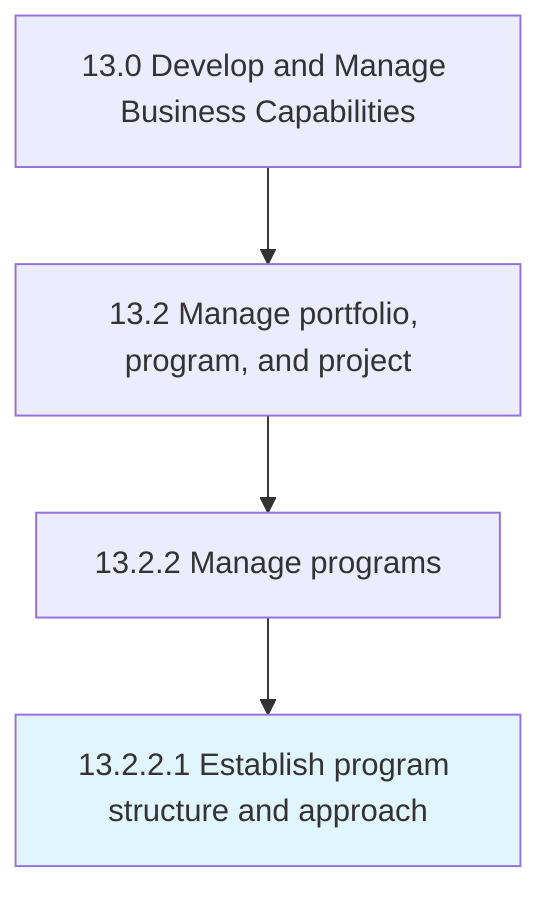

# Establish program structure and approach

> Constructing and instituting the framework and approach to manage business programs.

## Overview

Activity 13.2.2.1 is an activity within the Develop and Manage Business Capabilities framework. 

Constructing and instituting the framework and approach to manage business programs. Monitor key factors such as governance, alignment with the overall business vision, assurance, and management.

## Process Hierarchy



## Key Statistics

| Metric | Value |
|--------|-------|
| APQC Code | 16406 |
| Hierarchy ID | 13.2.2.1 |
| Level | Activity |
| Parent | [13.2.2](../) |
| Sub-Processes | 0 |


## GraphDL Semantic Structure

```
establish.ProgramStructureAndApproach
```

| Component | Value | Description |
|-----------|-------|-------------|
| Verb | `establish` | Primary action |
| Object | `program structure and approach` | Direct object |


## Related Concepts

- ProgramStructure
- Approach


---

*Source: APQC PCF 16406 (13.2.2.1) - APQC*
