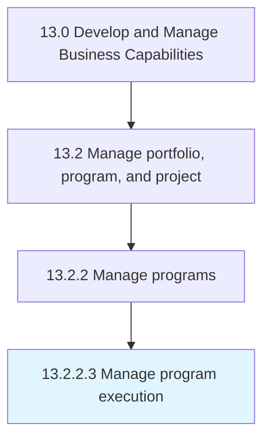

# Manage program execution

> Administering and implementing business programs.

## Overview

Activity 13.2.2.3 is an activity within the Develop and Manage Business Capabilities framework. 

Administering and implementing business programs. Implement and execute programs with the intention of improving an organization's performance. Execute all the individual projects of the program to ensure the desired success.

## Process Hierarchy



## Key Statistics

| Metric | Value |
|--------|-------|
| APQC Code | 16408 |
| Hierarchy ID | 13.2.2.3 |
| Level | Activity |
| Parent | [13.2.2](../) |
| Sub-Processes | 0 |


## GraphDL Semantic Structure

```
manage.ProgramExecution
```

| Component | Value | Description |
|-----------|-------|-------------|
| Verb | `manage` | Primary action |
| Object | `program execution` | Direct object |


## Related Concepts

- ProgramExecution


---

*Source: APQC PCF 16408 (13.2.2.3) - APQC*
