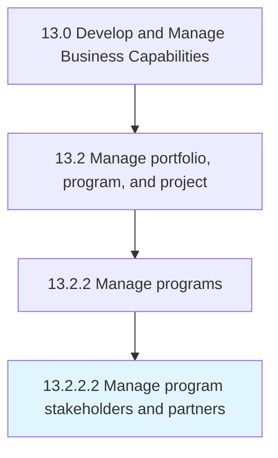

# Manage program stakeholders and partners

> Managing relationships with stakeholders and partners of the business programs.

## Overview

Activity 13.2.2.2 is an activity within the Develop and Manage Business Capabilities framework. 

Managing relationships with stakeholders and partners of the business programs.

## Process Hierarchy



## Key Statistics

| Metric | Value |
|--------|-------|
| APQC Code | 16407 |
| Hierarchy ID | 13.2.2.2 |
| Level | Activity |
| Parent | [13.2.2](../) |
| Sub-Processes | 0 |


## GraphDL Semantic Structure

```
manage.ProgramStakeholdersAndPartners
```

| Component | Value | Description |
|-----------|-------|-------------|
| Verb | `manage` | Primary action |
| Object | `program stakeholders and partners` | Direct object |


## Related Concepts

- ProgramStakeholders
- Partners


---

*Source: APQC PCF 16407 (13.2.2.2) - APQC*
