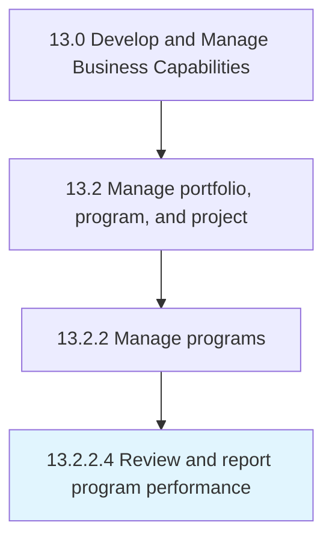

# Review and report program performance

> Evaluating and documenting the performance of business programs.

## Overview

Activity 13.2.2.4 is an activity within the Develop and Manage Business Capabilities framework. 

Evaluating and documenting the performance of business programs. Evaluate the performance of the programs. Create reports on the basis of the analysis. Use performance indicators and metrics such as desired/achieved goals, completion dates, issues and defects, and cost effectiveness.

## Process Hierarchy



## Key Statistics

| Metric | Value |
|--------|-------|
| APQC Code | 16409 |
| Hierarchy ID | 13.2.2.4 |
| Level | Activity |
| Parent | [13.2.2](../) |
| Sub-Processes | 0 |


## GraphDL Semantic Structure

```
review.AndReportProgramPerformance
```

| Component | Value | Description |
|-----------|-------|-------------|
| Verb | `review` | Primary action |
| Object | `and report program performance` | Direct object |


## Related Concepts

- ProgramPerformance
- ProgramPerformance


---

*Source: APQC PCF 16409 (13.2.2.4) - APQC*
