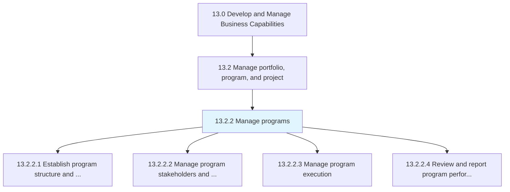
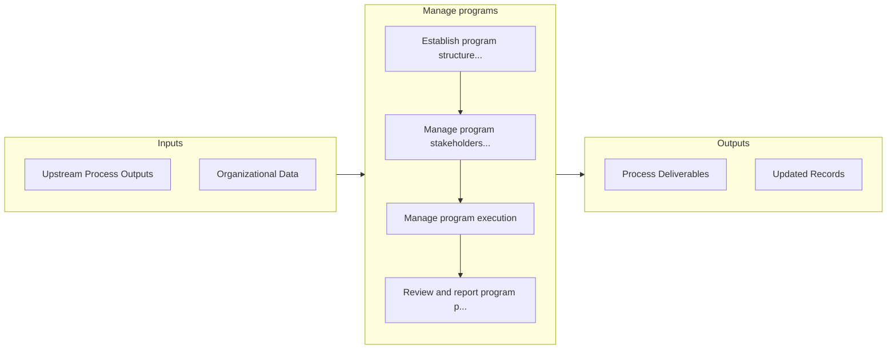

# Manage programs

> Establishing, implementing, and managing business programs.

## Overview

Process 13.2.2 is a core process that defines the specific procedures for manage programs. 

Establishing, implementing, and managing business programs. Successfully handle related projects that together constitute a program. Establish the program structure and approach. Coordinate with stakeholders and partners. Execute the program. Assess and report the performance of the program. Coordinate and prioritize resources across projects. Manage links between the projects and the overall costs and risks of the program.

## Process Hierarchy



## Key Statistics

| Metric | Value |
|--------|-------|
| APQC Code | 16405 |
| Hierarchy ID | 13.2.2 |
| Level | Process |
| Parent | [13.2](../) |
| Sub-Processes | 4 |


## GraphDL Semantic Structure

```
manage.Programs
```

| Component | Value | Description |
|-----------|-------|-------------|
| Verb | `manage` | Primary action |
| Object | `programs` | Direct object |


## Process Flow



## Sub-Processes

| Process | Hierarchy ID | Description |
|---------|-------------|-------------|
| [Establish program structure and approach](./EstablishProgramStructureAndApproach) | 13.2.2.1 | Constructing and instituting the framework and approach to manage business programs |
| [Manage program stakeholders and partners](./ManageProgramStakeholdersAndPartners) | 13.2.2.2 | Managing relationships with stakeholders and partners of the business programs |
| [Manage program execution](./ManageProgramExecution) | 13.2.2.3 | Administering and implementing business programs |
| [Review and report program performance](./ReviewAndReportProgramPerformance) | 13.2.2.4 | Evaluating and documenting the performance of business programs |


## Related Concepts

- Programs


---

*Source: APQC PCF 16405 (13.2.2) - APQC*
