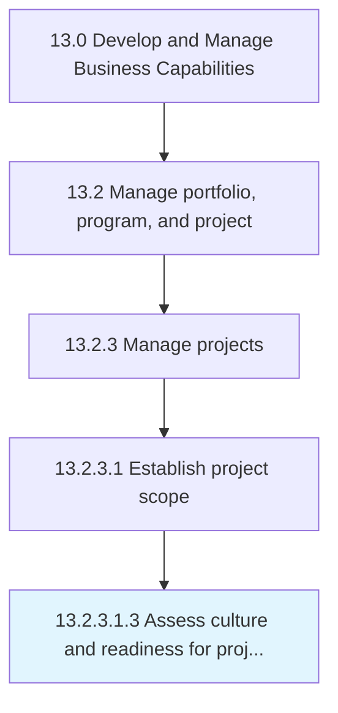

# Assess culture and readiness for project management approach

> Evaluating the culture and readiness of the organizational environment is order to implement the project management approach.

## Overview

Sub-Activity 13.2.3.1.3 is an activity within the Develop and Manage Business Capabilities framework. 

Evaluating the culture and readiness of the organizational environment is order to implement the project management approach.

## Process Hierarchy



## Key Statistics

| Metric | Value |
|--------|-------|
| APQC Code | 11118 |
| Hierarchy ID | 13.2.3.1.3 |
| Level | Sub-Activity |
| Parent | [13.2.3.1](../) |
| Sub-Processes | 0 |


## GraphDL Semantic Structure

```
assess.CultureAndReadiness.for.ProjectManagementApproach
```

| Component | Value | Description |
|-----------|-------|-------------|
| Verb | `assess` | Primary action |
| Object | `culture and readiness` | Direct object |
| Preposition | `for` | Relationship |
| PrepObject | `project management approach` | Indirect object |


## Related Concepts

- Culture
- ProjectManagementApproach
- Readiness
- ProjectManagementApproach


---

*Source: APQC PCF 11118 (13.2.3.1.3) - APQC*
