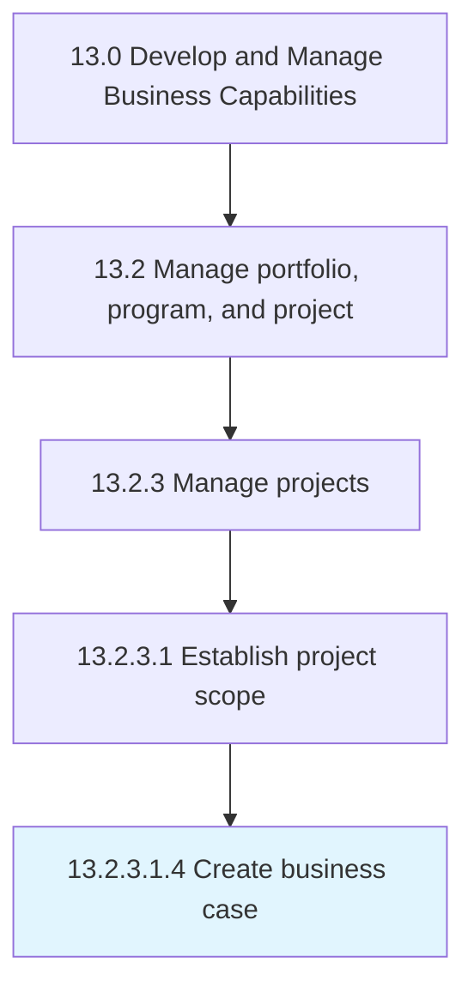

# Create business case

> Creating a document that includes the current situation, proposed solution, financial analysis, conclusion, etc.

## Overview

Sub-Activity 13.2.3.1.4 is an activity within the Develop and Manage Business Capabilities framework. 

Creating a document that includes the current situation, proposed solution, financial analysis, conclusion, etc. Convince a decision maker and investors to approve the project. Obtain funding.

## Process Hierarchy



## Key Statistics

| Metric | Value |
|--------|-------|
| APQC Code | 11120 |
| Hierarchy ID | 13.2.3.1.4 |
| Level | Sub-Activity |
| Parent | [13.2.3.1](../) |
| Sub-Processes | 0 |


## GraphDL Semantic Structure

```
create.BusinessCase
```

| Component | Value | Description |
|-----------|-------|-------------|
| Verb | `create` | Primary action |
| Object | `business case` | Direct object |


## Related Concepts

- [BusinessCase](/concepts/BusinessCase)


---

*Source: APQC PCF 11120 (13.2.3.1.4) - APQC*
