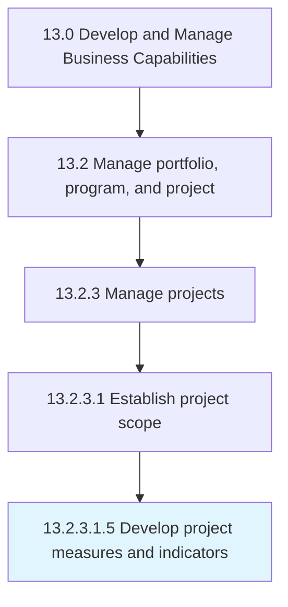

# Develop project measures and indicators

> Developing procedures and indictors to assess performance of business projects.

## Overview

Sub-Activity 13.2.3.1.5 is an activity within the Develop and Manage Business Capabilities framework. 

Developing procedures and indictors to assess performance of business projects. Design and develop metrics and indicators--such as cost, schedule, resources, risk, and quality--that exhibit the performance of the business projects.

## Process Hierarchy



## Key Statistics

| Metric | Value |
|--------|-------|
| APQC Code | 11121 |
| Hierarchy ID | 13.2.3.1.5 |
| Level | Sub-Activity |
| Parent | [13.2.3.1](../) |
| Sub-Processes | 0 |


## GraphDL Semantic Structure

```
develop.ProjectMeasuresAndIndicators
```

| Component | Value | Description |
|-----------|-------|-------------|
| Verb | `develop` | Primary action |
| Object | `project measures and indicators` | Direct object |


## Related Concepts

- ProjectMeasures
- Indicators


---

*Source: APQC PCF 11121 (13.2.3.1.5) - APQC*
