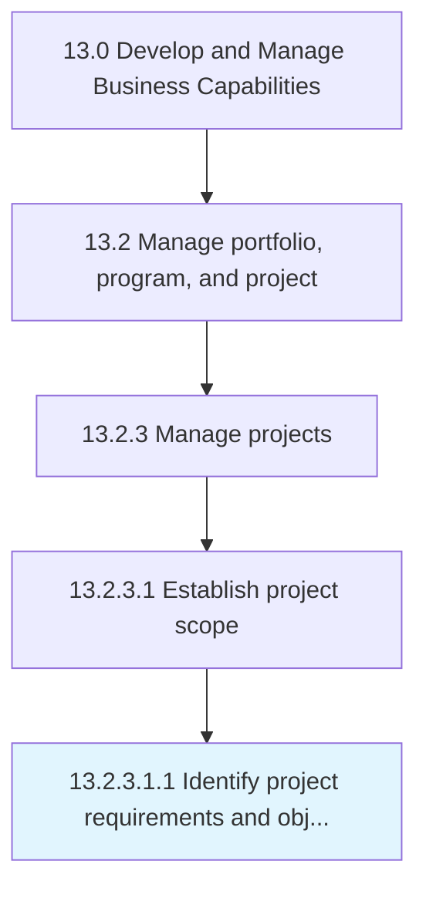

# Identify project requirements and objectives

> Recognizing and defining what the project is ultimately supposed to do.

## Overview

Sub-Activity 13.2.3.1.1 is an activity within the Develop and Manage Business Capabilities framework. 

Recognizing and defining what the project is ultimately supposed to do. Specify the capabilities, features, or attributes of the project's deliverables, as well as any kind of formal documentation.

## Process Hierarchy



## Key Statistics

| Metric | Value |
|--------|-------|
| APQC Code | 11117 |
| Hierarchy ID | 13.2.3.1.1 |
| Level | Sub-Activity |
| Parent | [13.2.3.1](../) |
| Sub-Processes | 0 |


## GraphDL Semantic Structure

```
identify.ProjectRequirementsAndObjectives
```

| Component | Value | Description |
|-----------|-------|-------------|
| Verb | `identify` | Primary action |
| Object | `project requirements and objectives` | Direct object |


## Related Concepts

- ProjectRequirements
- Objectives


---

*Source: APQC PCF 11117 (13.2.3.1.1) - APQC*
