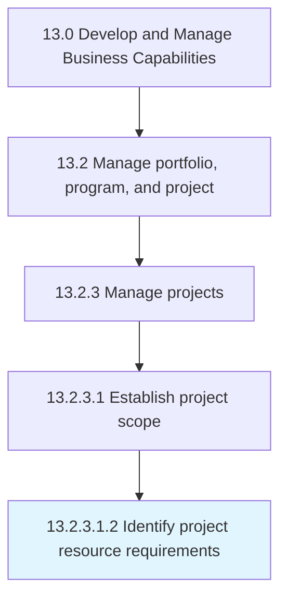

# Identify project resource requirements

> Identifying the prerequisites of business projects.

## Overview

Sub-Activity 13.2.3.1.2 is an activity within the Develop and Manage Business Capabilities framework. 

Identifying the prerequisites of business projects. Identify the people with appropriate and applicable skills and competencies. Locate resources such as capital, facilities, equipment, material, and information required to accomplish the objectives of a specific project.

## Process Hierarchy



## Key Statistics

| Metric | Value |
|--------|-------|
| APQC Code | 16412 |
| Hierarchy ID | 13.2.3.1.2 |
| Level | Sub-Activity |
| Parent | [13.2.3.1](../) |
| Sub-Processes | 0 |


## GraphDL Semantic Structure

```
identify.ProjectResourceRequirements
```

| Component | Value | Description |
|-----------|-------|-------------|
| Verb | `identify` | Primary action |
| Object | `project resource requirements` | Direct object |


## Related Concepts

- ProjectResourceRequirements


---

*Source: APQC PCF 16412 (13.2.3.1.2) - APQC*
