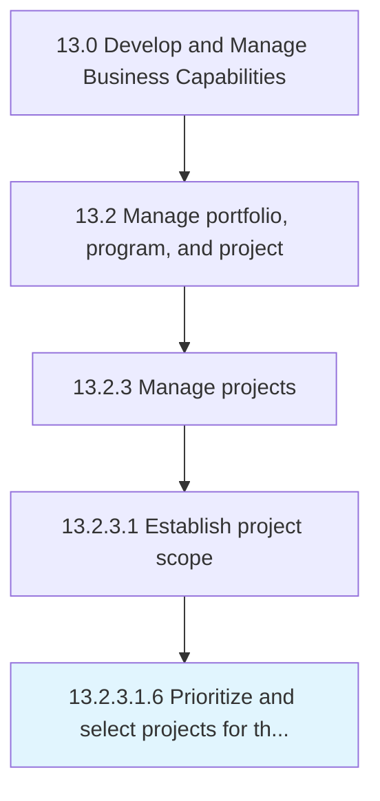

# Prioritize and select projects for the portfolio

> Stack ranking of projects in the portfolio based upon preestablished criteria.

## Overview

Sub-Activity 13.2.3.1.6 is an activity within the Develop and Manage Business Capabilities framework. 

Stack ranking of projects in the portfolio based upon preestablished criteria.

## Process Hierarchy



## Key Statistics

| Metric | Value |
|--------|-------|
| APQC Code | 21454 |
| Hierarchy ID | 13.2.3.1.6 |
| Level | Sub-Activity |
| Parent | [13.2.3.1](../) |
| Sub-Processes | 0 |


## GraphDL Semantic Structure

```
prioritize.AndSelectProjects.for.ThePortfolio
```

| Component | Value | Description |
|-----------|-------|-------------|
| Verb | `prioritize` | Primary action |
| Object | `and select projects` | Direct object |
| Preposition | `for` | Relationship |
| PrepObject | `the portfolio` | Indirect object |


## Related Concepts

- Projects
- Portfolio
- Projects
- Portfolio


---

*Source: APQC PCF 21454 (13.2.3.1.6) - APQC*
