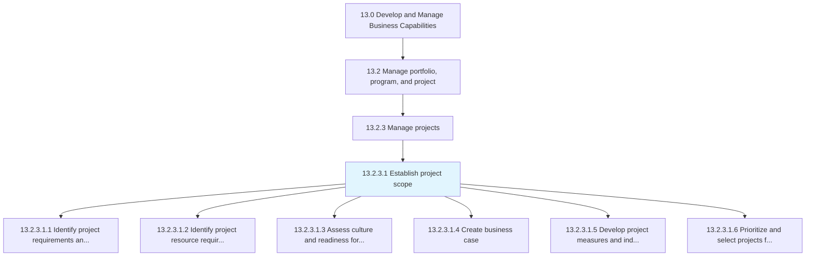
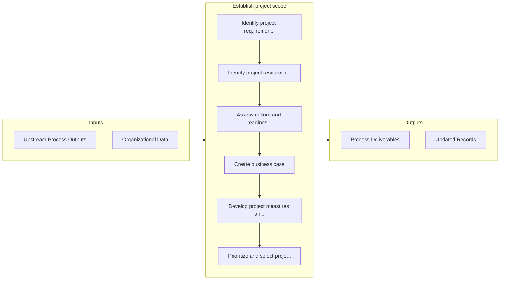

# Establish project scope

> Establishing the horizons of business projects.

## Overview

Activity 13.2.3.1 is an activity within the Develop and Manage Business Capabilities framework. 

Establishing the horizons of business projects. Identify the objectives of the program, along with the resource requirements. Assess the readiness for the project management approach. Identify methodologies for project management. Obtain funding. Develop performance measures and indicators.

## Process Hierarchy



## Key Statistics

| Metric | Value |
|--------|-------|
| APQC Code | 16411 |
| Hierarchy ID | 13.2.3.1 |
| Level | Activity |
| Parent | [13.2.3](../) |
| Sub-Processes | 6 |


## GraphDL Semantic Structure

```
establish.ProjectScope
```

| Component | Value | Description |
|-----------|-------|-------------|
| Verb | `establish` | Primary action |
| Object | `project scope` | Direct object |


## Process Flow



## Sub-Processes

| Process | Hierarchy ID | Description |
|---------|-------------|-------------|
| [Identify project requirements and objectives](./IdentifyProjectRequirementsAndObjectives) | 13.2.3.1.1 | Recognizing and defining what the project is ultimately supposed to do |
| [Identify project resource requirements](./IdentifyProjectResourceRequirements) | 13.2.3.1.2 | Identifying the prerequisites of business projects |
| [Assess culture and readiness for project management approach](./AssessCultureAndReadinessForProjectManagementApproach) | 13.2.3.1.3 | Evaluating the culture and readiness of the organizational environment is order to implement the pro |
| [Create business case](./CreateBusinessCase) | 13.2.3.1.4 | Creating a document that includes the current situation, proposed solution, financial analysis, conc |
| [Develop project measures and indicators](./DevelopProjectMeasuresAndIndicators) | 13.2.3.1.5 | Developing procedures and indictors to assess performance of business projects |
| [Prioritize and select projects for the portfolio](./PrioritizeAndSelectProjectsForThePortfolio) | 13.2.3.1.6 | Stack ranking of projects in the portfolio based upon preestablished criteria |


## Related Concepts

- [ProjectScope](/concepts/ProjectScope)


---

*Source: APQC PCF 16411 (13.2.3.1) - APQC*
