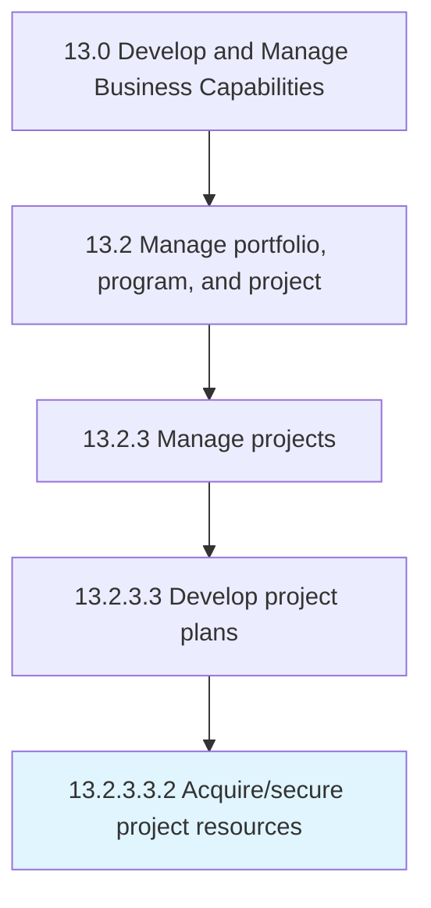

# Acquire/secure project resources

> Procuring the necessary resources outlined in Define roles and resources [11123].

## Overview

Sub-Activity 13.2.3.3.2 is an activity within the Develop and Manage Business Capabilities framework. 

Procuring the necessary resources outlined in Define roles and resources [11123]

## Process Hierarchy



## Key Statistics

| Metric | Value |
|--------|-------|
| APQC Code | 20142 |
| Hierarchy ID | 13.2.3.3.2 |
| Level | Sub-Activity |
| Parent | [13.2.3.3](../) |
| Sub-Processes | 0 |


## GraphDL Semantic Structure

```
acquire/secure.ProjectResources
```

| Component | Value | Description |
|-----------|-------|-------------|
| Verb | `acquire/secure` | Primary action |
| Object | `project resources` | Direct object |


## Related Concepts

- ProjectResources
- ProjectResources


---

*Source: APQC PCF 20142 (13.2.3.3.2) - APQC*
