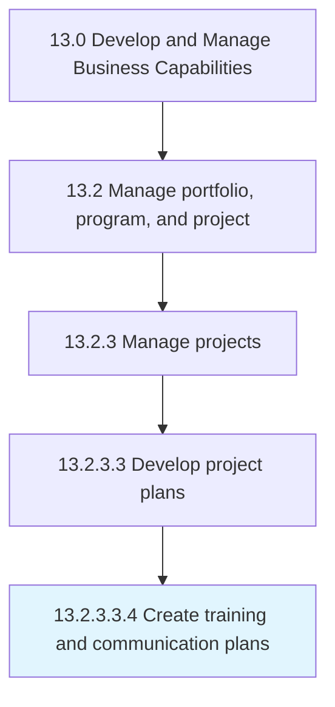

# Create training and communication plans

> Designing a plan for equipping the project team with the necessary skills and abilities to fulfill their roles and responsibilities in the project effectively and efficiently.

## Overview

Sub-Activity 13.2.3.3.4 is an activity within the Develop and Manage Business Capabilities framework. 

Designing a plan for equipping the project team with the necessary skills and abilities to fulfill their roles and responsibilities in the project effectively and efficiently. Offer formal training, mentoring, or coaching. Initiate informal conversations. Communicate messages during the project.

## Process Hierarchy



## Key Statistics

| Metric | Value |
|--------|-------|
| APQC Code | 11125 |
| Hierarchy ID | 13.2.3.3.4 |
| Level | Sub-Activity |
| Parent | [13.2.3.3](../) |
| Sub-Processes | 0 |


## GraphDL Semantic Structure

```
create.TrainingAndCommunicationPlans
```

| Component | Value | Description |
|-----------|-------|-------------|
| Verb | `create` | Primary action |
| Object | `training and communication plans` | Direct object |


## Related Concepts

- [TrainingPlans](/concepts/TrainingPlans)
- [CommunicationPlans](/concepts/CommunicationPlans)


---

*Source: APQC PCF 11125 (13.2.3.3.4) - APQC*
